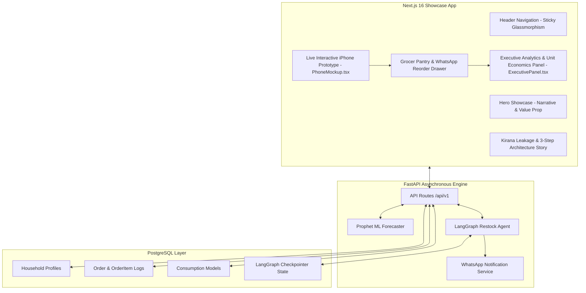

# ARCHITECTURE.md — Product Strategy & User Experience Architecture

---

## 1. PRODUCT VISION & STRATEGIC PURPOSE

### The Problem: Reactive Commerce & Daily Staple Stockout Gap
Quick commerce platforms (Zepto, Blinkit, Swiggy Instamart, BigBasket) offer 10-minute delivery, but their replenishment mechanics are fundamentally **reactive**:
- **MilkBasket** built a standalone company around scheduled recurring morning deliveries of milk and staples — proving the predictable staple demand pattern is real.
- **Blinkit** features a one-tap reorder button from order history — proving platforms recognize repeat velocity, but current implementations remain passive (waiting for the user to open the app).
- **The Gap:** No platform has shipped a pre-emptive replenishment engine — predicting depletion 24 hours in advance and delivering low-friction WhatsApp nudges.

### The Prototype: Grocer ML & Agent System
Grocer is a self-directed engineering prototype and problem exploration. It tracks household grocery consumption velocity (e.g. Milk 0.48L/day, Tomatoes 140g/day) using Prophet ML and predicts stockouts 24 hours before items run out. 

Instead of opening the app to browse, users receive an interactive WhatsApp quick-reply notification (`Confirm` / `Remind` / `Skip`). Replying `Confirm` triggers a 5-node LangGraph execution state machine (`RestockAgent`).

### Why We Have the Landing Page & Mockup iPhone

1. **Why We Have the Landing Page (`app/page.tsx`)**:
   - Serves as an **Engineering Prototype Showcase & Problem Exploration**.
   - Demonstrates the full-stack architecture (Prophet ML time-series forecasting, anomaly exclusion, 5-node LangGraph agent graph).
   - Intellectually honest: Zero fake statistics or vendor pitch claims.

2. **Why We Have the Mockup iPhone (`PhoneMockup.tsx` & `ui/iphone.tsx`)**:
   - **The Mockup iPhone is the live interactive prototype demo itself** embedded right inside the landing page hero section.
   - Visitors test the system live:
     - Testing pantry stock depletion fill bars and velocity steppers (`Pantry Stock`).
     - Fulfilling missing ingredients for recipes in 1 tap (`Recipe Checker`).
     - Monitoring real-time commodity price trends (`Price Signals`).
     - Simulating automated 1-tap WhatsApp restocking chat overlays.

---

## 2. USER EXPERIENCE & INTERACTION ARCHITECTURE

```mermaid
flowchart TD
    subgraph LandingPage [Showcase Landing Page - app/page.tsx]
        A[Header Navigation - Sticky Glassmorphism]
        B[Hero Pitch - 'Predict stockouts. Automate restocks.']
        C[Centered Hardware Stage - PhoneMockup.tsx]
        D[Executive Panel & Unit Economics - ExecutivePanel.tsx]
        E[Feature Sidebar & Bento Architecture Grid]
    end

    subgraph PhoneApp [Mockup iPhone App Demo - PhoneMockup.tsx]
        F[Header - Green Park 10-Min Location & Search]
        G[Segmented Sub-Tabs - Pantry | Recipes | Signals | All]
        H[Pantry Stock View - Stock Fill Bars & -/+ Steppers]
        I[Recipe Checker View - Dish Picker & Missing Ingredient Cart]
        J[Price Signals View - Commodity Spike/Dip Trend Board]
        K[Floating WhatsApp Button - Bottom-Right Corner]
        L[WhatsApp Chat Overlay - 1-Tap Restock Confirmation]
    end

    LandingPage --> C
    C --> F
    F --> G
    G --> H
    G --> I
    G --> J
    H --> K
    I --> K
    J --> K
    K --> L
```

---

## 3. HOW THE USER SEES AND USES THE APP

### View 1: Pantry Stock Depletion (`grocerSubTab = "pantry"`)
- **What the User Sees:**
  - **Smart Restock Overview Banner:** Pastel Blue card highlighting total household pantry health (*"2 items running low in 24h"*).
  - **Stockout Warning Banner:** Pastel Amber warning highlighting milk & tomatoes running low.
  - **Item Depletion Cards:** Fresh Milk 1L (`20% LOW`, `0.48L/day`), Tomatoes 500g (`14% LOW`, `140g/day`), Farm Eggs (`35%`), Wheat Bread (`65%`).
- **How the User Interacts:**
  - Tap `-` / `+` steppers on item cards to manually adjust quantities or add items directly to cart.

### View 2: Recipe Ingredient Checker (`grocerSubTab = "recipes"`)
- **What the User Sees:**
  - **Dish Selector Pills:** Biryani, Dal Makhani, Paneer Tikka, Oats Bowl.
  - **Ingredient Stock Checklist:** Color-coded status icons showing stocked items (Green Check) vs missing items with prices (Red X, e.g. Paneer ₹90, Cream ₹55).
- **How the User Interacts:**
  - Tap dish selector pills to switch recipes.
  - Tap *"Add Missing Ingredients to Cart"* to instantly add all missing recipe ingredients to the global floating cart.

### View 3: Commodity Price Signals (`grocerSubTab = "signals"`)
- **What the User Sees:**
  - **Market Commodity Board:** Compare current price vs 30-day average (`Tomatoes Today ₹48 vs Avg ₹20`, `Sunflower Oil Today ₹98 vs Avg ₹127`).
  - **Signal Badges:** `SPIKE +140%` (Red) or `DIP -23% Stock Up` (Green).

### View 4: Floating WhatsApp Restock Chat Overlay
- **What the User Sees:**
  - A circular `#25D366` green WhatsApp icon floating at `bottom-14 right-3 z-40` with a red unread notification badge.
- **How the User Interacts:**
  - Tap the floating WhatsApp icon to slide open the WhatsApp chat drawer (`#075E54` header).
  - Tap quick action chips (`YES (Confirm ₹118)`, `+ Add Bread`, `Skip`) to simulate automated 1-tap reordering.
  - Upon confirmation, pantry stock fill bars automatically reset to 100% with a success toast notification.

---

### The Core Features Explained

#### Consumption Modeling

**What it does in plain English:**
The system reads every order you've ever placed and builds a profile for each recurring item. It figures out: "This household buys 1L milk every 2.1 days on average. Sometimes 1.9 days, sometimes 2.4 days, but almost always within that range."

**How it works technically:**
- Pulls your complete order history from the quick commerce MCP API.
- For each item that appears more than 3 times, it runs a time-series analysis using Facebook Prophet (an open-source forecasting library).
- Prophet handles weekly patterns (you buy more groceries on Sunday), seasonal patterns, and random noise.
- The output is a consumption model per item: average daily usage, typical purchase cycle, and a confidence score.

#### Predictive Restocking

**What it does in plain English:**
Once the system knows your consumption rates, it monitors all your items in the background. Two days before any item is predicted to run out, it sends you a WhatsApp message asking if you want to reorder. You reply YES. It builds the cart and places the order. You never open the app.

**How it works technically:**
- A background scheduler (APScheduler) runs every morning at 8am.
- It checks all consumption models for items where `estimated_depletion_date < NOW() + 2 days`.
- For matching items, it generates a friendly WhatsApp message using LLM prompt templates.
- The message is sent via Twilio WhatsApp API / sandbox drawer simulator.
- When you reply, a LangGraph agent parses your response and either places the order, modifies the cart, or dismisses the alert.

---

## 2. SYSTEM ARCHITECTURE



---

## 3. DATABASE SCHEMA & DATA MODELS

```sql
-- Households
CREATE TABLE households (
    id UUID PRIMARY KEY DEFAULT gen_random_uuid(),
    user_id VARCHAR(255) NOT NULL UNIQUE,
    phone_number VARCHAR(50),
    composition VARCHAR(50) DEFAULT 'couple', -- solo, couple, family_small, family_large
    composition_confidence FLOAT DEFAULT 0.8,
    intelligence_consent BOOLEAN DEFAULT TRUE,
    notifications_enabled BOOLEAN DEFAULT TRUE,
    created_at TIMESTAMPTZ DEFAULT NOW(),
    updated_at TIMESTAMPTZ DEFAULT NOW()
);

-- Orders
CREATE TABLE orders (
    id UUID PRIMARY KEY DEFAULT gen_random_uuid(),
    household_id UUID REFERENCES households(id) ON DELETE CASCADE,
    quick_commerce_order_id VARCHAR(255) UNIQUE,
    placed_at TIMESTAMPTZ NOT NULL,
    total_amount FLOAT NOT NULL,
    raw_data JSONB,
    created_at TIMESTAMPTZ DEFAULT NOW()
);

-- Order items
CREATE TABLE order_items (
    id UUID PRIMARY KEY DEFAULT gen_random_uuid(),
    order_id UUID REFERENCES orders(id) ON DELETE CASCADE,
    item_id VARCHAR(255) NOT NULL,
    item_name VARCHAR(500) NOT NULL,
    category VARCHAR(255),
    quantity INTEGER NOT NULL,
    unit VARCHAR(50) DEFAULT 'pcs',
    standard_quantity FLOAT,
    price FLOAT NOT NULL
);

-- Consumption models
CREATE TABLE consumption_models (
    id UUID PRIMARY KEY DEFAULT gen_random_uuid(),
    household_id UUID REFERENCES households(id) ON DELETE CASCADE,
    item_id VARCHAR(255) NOT NULL,
    item_name VARCHAR(500) NOT NULL,
    category VARCHAR(255),
    avg_daily_consumption FLOAT,
    consumption_cycle_days FLOAT,
    last_purchase_date TIMESTAMPTZ,
    last_purchase_quantity FLOAT,
    estimated_depletion_date TIMESTAMPTZ,
    confidence_score FLOAT DEFAULT 0.0,
    data_points INTEGER DEFAULT 0,
    is_anomaly_excluded BOOLEAN DEFAULT FALSE,
    updated_at TIMESTAMPTZ DEFAULT NOW(),
    UNIQUE(household_id, item_id)
);
```

---

## 4. FRONTEND ARCHITECTURE & DESIGN SYSTEM ("SHADE")

The Grocer frontend is built as a single-page narrative showcase (`app/page.tsx`) centered around a live, hands-on interactive product demo inside an iPhone hardware mockup (`PhoneMockup.tsx` & `ui/iphone.tsx`).

### A. Mockup iPhone Architecture (`PhoneMockup.tsx` & `iphone.tsx`)

The mockup iPhone is **the core interactive demo of the Grocer platform**. It is constructed as a dual-layer hardware simulation:

1. **Outer Hardware Chassis (`ui/iphone.tsx`)**:
   - PNG overlay (`/iphone-16-pro-frame.png`) rendering Grade-5 titanium frame, hardware bezels, status bar, and Dynamic Island notch (`z-index: 20`, `pointer-events-none`).
   - Dimensions locked to physical iPhone 16 Pro specifications: `1800 × 3680` pixel aspect ratio (`w-[275px] h-[562px] aspect-[1800/3680] shrink-0 overflow-hidden`).

2. **Inner Screen Canvas (`PhoneMockup.tsx`)**:
   - Inset display container (`left: 5.0%`, `top: 2.3%`, `width: 90.0%`, `height: 95.4%`, `border-radius: 44px`, `overflow-hidden`).
   - Top clearance: `pt-[30px]` to prevent screen content from overlapping the Dynamic Island status bar.
   - Bottom clearance: `pb-20` to ensure scrollable content is never clipped under the bottom navigation bar.
   - Container-Isolated Scroll: WhatsApp drawer scrolling uses `chatContainerRef.current.scrollTop = chatContainerRef.current.scrollHeight`, guaranteeing zero landing page scroll jumps.

3. **Segmented Feature Sub-Tabs Navigation**:
   - Positioned directly below the search bar to eliminate vertical clutter on mobile screens:
     - `🛒 Pantry`: Stock depletion progress bars, daily velocity rates (`0.48L/day`), low-stock warnings, interactive `-` / `+` steppers.
     - `🍳 Recipes`: 4 recipe options (Chicken Biryani, Dal Makhani, Paneer Tikka, Oats Bowl) with ingredient availability checklist and 1-tap *"Add Missing Ingredients"* to cart.
     - `🏷️ Signals`: Commodity market volatility board showing price spike (`+140%`) and price dip (`-23% Stock Up`) signals.

4. **WhatsApp Restock Trigger & Order Loop**:
   - WhatsApp Bot button in top-right header opens the WhatsApp chat drawer overlay (`#ECE5DD` background, `#075E54` header, quick action chips).
   - Replying `YES` in WhatsApp chat triggers an end-to-end restock loop, automatically resetting depleted pantry items back to 100% stock fill with toast notifications.

### B. Design System Tokens & Aesthetics

- **Color Palette**:
  - Main Canvas: `#F6F7F8`
  - Primary Accent & Headings: `#252525`
  - Muted Text: `#64717E`
  - Borders: `#E5E7EB`
  - Active Surfaces: `.card-neutral-droxy` (`#FFFFFF` rounded cards with `box-shadow`)
- **Tactile Pill Buttons**:
  - `btn-droxy-pill-primary`: `#252525` background, `#FFFFFF` text, `shadow-droxy-pill`, active scaling `scale-[0.97]`.
  - `btn-droxy-pill-secondary`: `#FFFFFF` background, `#252525` text, border `#D1D5DB`.
- **Typography**:
  - Display & UI Text: `Outfit` (Google Fonts, `var(--font-outfit)`).
  - Editorial Title Accents: `Cambo` (Google Fonts, `var(--font-cambo)`).

---

## 5. API CONTRACTS & INTEGRATIONS

- **`get_platform_orders`**: Complete order history — every order placed, every item, quantities, prices, timestamps.
- **`search_platform_items`**: Product listings matching a search query — item ID, name, price, available sizes.
- **`update_platform_cart`**: Updated cart state with all items.
- **`get_platform_cart`**: Current cart contents and total.
- **`place_platform_order`**: Order confirmation with order ID and estimated delivery time.
- **`track_platform_order`**: Real-time order status.

---

## 6. LANDING PAGE NARRATIVE SHOWCASE (`app/page.tsx`)

The landing page is a 14-section narrative showcase designed to take quick commerce operators and users from problem discovery to interactive proof:

1. **Sticky Glassmorphism Header (`Header.tsx`)**: Grocer logo, feature navigation links, demo stage anchor button.
2. **Hero Showcase Section**: High-impact display headline (*"Predict stockouts. Automate restocks."*), tagline badge, dual pill buttons (*Try Prototype*, *View ROI*).
3. **Centered Hardware Stage (`#demo-stage`)**: Showcase card housing `PhoneMockup.tsx` on the left and live prototype overview controls on the right.
4. **Quick Commerce Platform Cloud & Video Banner**: Platform logos (Zepto, Blinkit, Swiggy Instamart, BigBasket) + 4-minute explainer link.
5. **Interactive Feature Sidebar (`GrocerFeatureSidebar.tsx`)**: 5 core platform capabilities (Prophet ML, LangGraph Agents, Recipe Checker, Price Signals, Anomaly Filtering).
6. **Practical Use Cases Showcase (`GrocerPracticalUse.tsx`)**: Household category breakdowns (Dairy, Staples, Cleaners, Organics).
7. **Competitive Matrix Table (`#comparison`)**: Side-by-side comparison table (*Without Grocer vs With Grocer*).
8. **Human-like Interactions Section**: 3 feature cards highlighting Brand Tone Matching, Empathetic Reorders, and LangGraph NLP.
9. **5-Step Accordion Setup Guide (`#how-it-works`)**: Interactive step-by-step onboarding walkthrough (Connect Data, Set Triggers, Deploy WhatsApp, Monitor Depletion, Adapt & Scale).
10. **Smart Safeguards Banner**: Safety boundaries, catalog grounding, and non-hallucinatory agent enforcement.
11. **Visual 6-Card Bento Grid (`GrocerBentoGrid.tsx`)**: Visual bento grid showcasing technical architecture (Prophet ML, Checkpointer, Webhooks, WhatsApp 1-Tap).
12. **Executive ROI Analytics Panel (`#platform-roi` / `ExecutivePanel.tsx`)**: Live unit economics dashboard with interactive household scenario switcher (Solo, Couple, Family Small, Family Large).
13. **Customer Testimonials**: Testimonial feedback cards with 5-star ratings and quick commerce user reviews.
14. **FAQ Accordion & Final CTA Footer**: Interactive FAQ accordion answering top 5 customer questions + final dark CTA banner and footer.

---

## 7. REPO MAP & FILE ORGANIZATION

```
Grocer/
├── backend/
│   ├── agents/ (restock_agent.py, price_agent.py, recipe_agent.py)
│   ├── api/ (routes/ orders.py, predictions.py, prices.py, recipes.py, restock.py)
│   ├── database/ (connection.py, models.py)
│   ├── ml/ (consumption_model.py, anomaly_detector.py, confidence_scorer.py)
│   └── tests/ (16 test files)
└── frontend/
    ├── app/ (page.tsx, layout.tsx, globals.css)
    └── components/
        ├── Header.tsx
        ├── PhoneMockup.tsx (Interactive iPhone Mockup Product Demo)
        ├── ExecutivePanel.tsx (Real-Time Analytics & Unit Economics)
        ├── GrocerFeatureSidebar.tsx (5 Core Capabilities Sidebar)
        ├── GrocerPracticalUse.tsx (Household Use Cases Showcase)
        ├── GrocerBentoGrid.tsx (Visual 6-Card Technical Bento Grid)
        └── ui/
            └── iphone.tsx (iPhone 16 Pro 6.3" SVG Hardware Chassis)
```

---

## DOMAIN GLOSSARY

- **Restock Alert**: A notification sent to a household listing items predicted to deplete soon.
- **Cart**: The active list of selected items and quantities ready for checkout.
- **Checkout**: The final step where a user confirms the cart to create and place an order.
- **Grocer Tab**: Single host bottom tab housing Pantry Stock, Recipe Checker, & Price Signals.
- **Segmented Sub-Tabs**: Header pills inside Grocer tab (`Pantry Stock`, `Recipes`, `Price Signals`, `All`).

