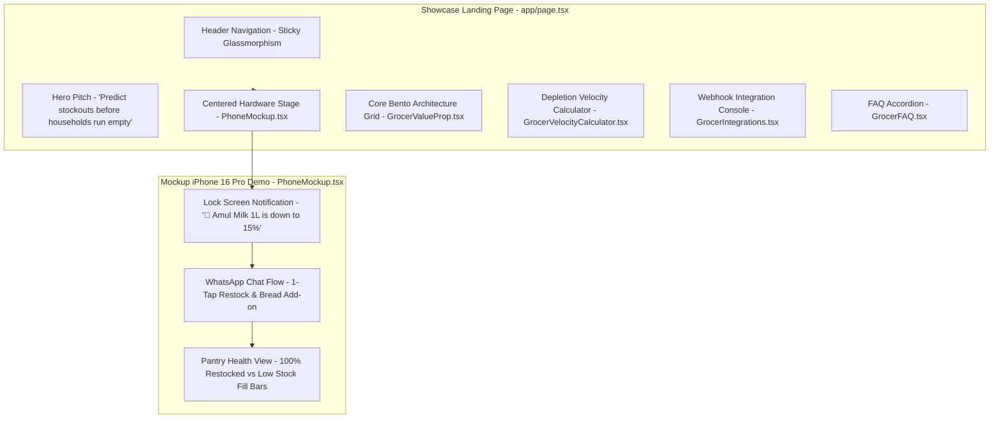

# ARCHITECTURE.md — Product Strategy & System Architecture

---

## 1. PRODUCT VISION & STRATEGIC PURPOSE

### The Problem: Reactive Commerce & Daily Staple Stockout Gap
Quick commerce platforms (Zepto, Blinkit, Swiggy Instamart, BigBasket) offer 10-minute delivery, but their replenishment mechanics are fundamentally **reactive**:
- **MilkBasket** built a standalone company around scheduled recurring morning deliveries of milk and staples — proving the predictable staple demand pattern is real.
- **Blinkit** features a one-tap reorder button from order history — proving platforms recognize repeat velocity, but current implementations remain passive (waiting for the user to open the app).
- **The Gap:** No platform has shipped a pre-emptive replenishment engine — predicting depletion 24 hours in advance and delivering low-friction WhatsApp nudges.

### The Prototype: Grocer Simulation & Showcase Engine
Grocer is a self-directed engineering prototype and problem exploration. It models household grocery consumption velocity (e.g. Milk 0.48L/day, Tomatoes 140g/day) and projects stockouts 24 hours before items run out.

Instead of opening the app to browse, users receive an interactive WhatsApp quick-reply notification (`Confirm` / `Add Bread` / `Remind`).

---

## 2. USER EXPERIENCE & SYSTEM ARCHITECTURE



---

## 3. CORE TECHNICAL COMPONENTS

```
Grocer Architecture
├── app/
│   ├── layout.tsx             # Root layout with fonts & metadata
│   ├── page.tsx               # Master showcase page
│   └── globals.css            # Tailwind CSS v4 design system
├── components/
│   ├── PhoneMockup.tsx        # iPhone 16 Pro interactive simulator
│   ├── grocer/                # Landing page bento cards & calculators
│   └── ui/                    # Authentic frames, buttons, badges
├── hooks/
│   └── usePhoneDemoEngine.ts  # State controller for iPhone demo & chat transitions
├── lib/
│   ├── simulationEngine.ts    # Household consumption velocity math & 5-node state machine
│   ├── mockData.ts            # Single source of truth for items, recipes, price signals
│   ├── types.ts               # Strong TypeScript contracts
│   └── utils.ts               # Date & text formatters
```

---

## 4. DESIGN INVARIANTS & PRINCIPLES
1. **Zero-Setup Runtime:** 100% self-contained Next.js application that runs with `npm run dev` and deploys instantly on Vercel without environment variables.
2. **Deterministic Simulation:** All depletion rates and state machine transitions execute client-side with zero latency.
3. **No AI Slop:** Clean typography (`Outfit` and `Cambo`), crisp Lucide icons, and zero arbitrary emojis in button text.
