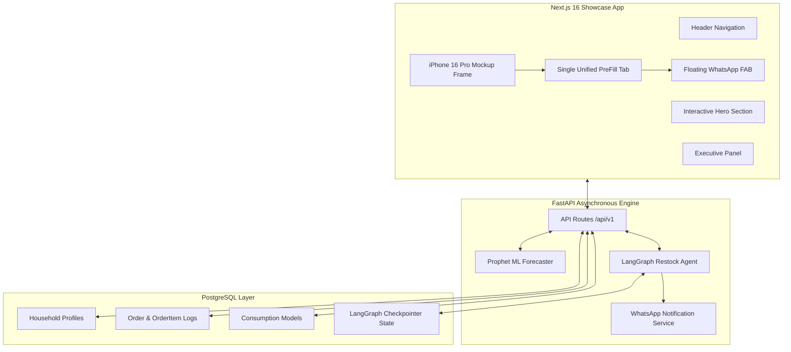

# ARCHITECTURE.md — The Technical Blueprint

_This document is for HUMANS to read. The AI will only read this when explicitly commanded via `@ZOOM` or when investigating complex database/architecture tasks._

---

## 1. PROJECT OVERVIEW & BUSINESS LOGIC

### The Simple Version

PreFill is an AI feature extension that sits on top of quick commerce platforms and watches how your household consumes groceries over time. It learns your patterns — how fast you go through milk, oil, atta, eggs, bread — and sends you a WhatsApp message before you run out, asking if you want to reorder. One tap and it's done.

It's the difference between a grocery app and a grocery assistant.

### The Real-World Analogy

Imagine you had a full-time house manager — someone who lives with you, watches what leaves the kitchen shelf, and automatically handles restocking. Before your cooking oil runs out, they've already placed the quick commerce order. Before you plan Sunday biryani, they've already checked what's in the pantry and added the missing ingredients to the cart.

That house manager is what this app pretends to be — except it's software that reads your quick commerce order history instead of physically watching your shelves.

### Why Does This Matter?

**The existential problem:** Quick commerce platforms are identical products. Same 10-minute delivery. Same Amul milk. Same prices. Same interface. A user has zero reason to be loyal to either one — they open whichever app they remember first.

**The solution this project creates:** If PreFill has been learning your household's grocery patterns for 6 months, it aggregates knowledge across platforms:

- Your family uses 1L milk every 2.1 days.
- You buy 5kg atta every 17 days, not 16 or 18.
- You always buy eggs and bread together on Sunday mornings.
- Your oil consumption spikes during festive seasons.
- You were away for 10 days in March (zero orders = travel detected).

If you switch to using another platform manually, you lose all of that. You're starting from zero. That intelligence — that knowledge about your household — is the switching cost. That's PreFill's moat. No other feature creates this kind of lock-in.

---

### The Core Features Explained

#### Consumption Modeling

**What it does in plain English:**
The system reads every order you've ever placed and builds a profile for each recurring item. It figures out: "This household buys 1L milk every 2.1 days on average. Sometimes 1.9 days, sometimes 2.4 days, but almost always within that range."

**How it works technically:**
- Pulls your complete order history from the quick commerce MCP API.
- For each item that appears more than 3 times, it runs a time-series analysis using Facebook Prophet (an open-source forecasting library).
- Prophet handles weekly patterns (you buy more groceries on Sunday), seasonal patterns, and random noise.
- The output is a consumption model per item: average daily usage, typical purchase cycle, and a confidence score.

#### Predictive Restocking

**What it does in plain English:**
Once the system knows your consumption rates, it monitors all your items in the background. Two days before any item is predicted to run out, it sends you a WhatsApp message asking if you want to reorder. You reply YES. It builds the cart and places the order. You never open the app.

**How it works technically:**
- A background scheduler (APScheduler) runs every morning at 8am.
- It checks all consumption models for items where `estimated_depletion_date < NOW() + 2 days`.
- For matching items, it generates a friendly WhatsApp message using LLM prompt templates.
- The message is sent via Twilio WhatsApp API / sandbox drawer simulator.
- When you reply, a LangGraph agent parses your response and either places the order, modifies the cart, or dismisses the alert.

---

## 2. SYSTEM ARCHITECTURE



---

## 3. DATABASE SCHEMA & DATA MODELS

```sql
-- Households
CREATE TABLE households (
    id UUID PRIMARY KEY DEFAULT gen_random_uuid(),
    user_id VARCHAR(255) NOT NULL UNIQUE,
    phone_number VARCHAR(50),
    composition VARCHAR(50) DEFAULT 'couple', -- solo, couple, family_small, family_large
    composition_confidence FLOAT DEFAULT 0.8,
    intelligence_consent BOOLEAN DEFAULT TRUE,
    notifications_enabled BOOLEAN DEFAULT TRUE,
    created_at TIMESTAMPTZ DEFAULT NOW(),
    updated_at TIMESTAMPTZ DEFAULT NOW()
);

-- Orders
CREATE TABLE orders (
    id UUID PRIMARY KEY DEFAULT gen_random_uuid(),
    household_id UUID REFERENCES households(id) ON DELETE CASCADE,
    quick_commerce_order_id VARCHAR(255) UNIQUE,
    placed_at TIMESTAMPTZ NOT NULL,
    total_amount FLOAT NOT NULL,
    raw_data JSONB,
    created_at TIMESTAMPTZ DEFAULT NOW()
);

-- Order items
CREATE TABLE order_items (
    id UUID PRIMARY KEY DEFAULT gen_random_uuid(),
    order_id UUID REFERENCES orders(id) ON DELETE CASCADE,
    item_id VARCHAR(255) NOT NULL,
    item_name VARCHAR(500) NOT NULL,
    category VARCHAR(255),
    quantity INTEGER NOT NULL,
    unit VARCHAR(50) DEFAULT 'pcs',
    standard_quantity FLOAT,
    price FLOAT NOT NULL
);

-- Consumption models
CREATE TABLE consumption_models (
    id UUID PRIMARY KEY DEFAULT gen_random_uuid(),
    household_id UUID REFERENCES households(id) ON DELETE CASCADE,
    item_id VARCHAR(255) NOT NULL,
    item_name VARCHAR(500) NOT NULL,
    category VARCHAR(255),
    avg_daily_consumption FLOAT,
    consumption_cycle_days FLOAT,
    last_purchase_date TIMESTAMPTZ,
    last_purchase_quantity FLOAT,
    estimated_depletion_date TIMESTAMPTZ,
    confidence_score FLOAT DEFAULT 0.0,
    data_points INTEGER DEFAULT 0,
    is_anomaly_excluded BOOLEAN DEFAULT FALSE,
    updated_at TIMESTAMPTZ DEFAULT NOW(),
    UNIQUE(household_id, item_id)
);
```

---

## 4. FRONTEND ARCHITECTURE & DESIGN SYSTEM

- **Mockup Device Frame:** iPhone 16 Pro physical hardware specifications (`71.5mm × 149.6mm`, `w-[305px] aspect-[71.5/149.6]`).
- **Typography:**
  - `Outfit` (Google Fonts): UI headings, body text, buttons, tags, chips.
  - `Cambo` (Google Fonts): Editorial title serif accent (regular weight, no italics).
- **Design System:** Pure Emil Kowalski design engineering (`#FAFAFA` neutral background, `#0F172A` headings, `active:scale-[0.97]` touch scaling with `160ms ease-out`).
- **Zero AI Slop:** No informal emojis in buttons or headings. Clean Lucide icons throughout.

---

## 5. API CONTRACTS & INTEGRATIONS

- **`get_platform_orders`**: Complete order history — every order placed, every item, quantities, prices, timestamps.
- **`search_platform_items`**: Product listings matching a search query — item ID, name, price, available sizes.
- **`update_platform_cart`**: Updated cart state with all items.
- **`get_platform_cart`**: Current cart contents and total.
- **`place_platform_order`**: Order confirmation with order ID and estimated delivery time.
- **`track_platform_order`**: Real-time order status.

---

## 6. REPO MAP & FILE ORGANIZATION

```
PreFill/
├── backend/
│   ├── agents/ (restock_agent.py, price_agent.py, recipe_agent.py)
│   ├── api/ (routes/ orders.py, predictions.py, prices.py, recipes.py, restock.py)
│   ├── database/ (connection.py, models.py)
│   ├── ml/ (consumption_model.py, anomaly_detector.py, confidence_scorer.py)
│   └── tests/ (16 test files)
└── frontend/
    ├── app/ (page.tsx, layout.tsx, globals.css)
    └── components/ (Header.tsx, PhoneMockup.tsx, ExecutivePanel.tsx, ui/iphone.tsx)
```

---

## DOMAIN GLOSSARY

- **Restock Alert**: A notification sent to a household listing items predicted to deplete soon.
- **Cart**: The active list of selected items and quantities ready for checkout.
- **Checkout**: The final step where a user confirms the cart to create and place an order.
- **PreFill Tab**: Single host bottom tab housing Pantry Stock, Recipe Checker, & Price Signals.
