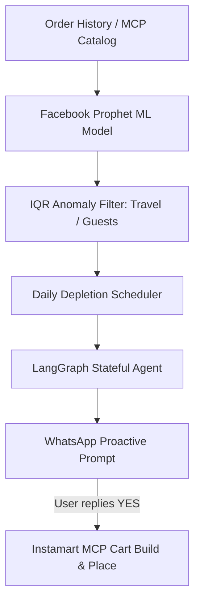

# EXECUTIVE_PITCH.md — Grocer: Predictive Household Inventory Intelligence for Quick Commerce

> **Target Audience:** Engineering, Product, & Growth Leadership at Quick Commerce Platforms (Blinkit, Swiggy Instamart, Zepto, BigBasket, Flipkart Minutes).

---

## 1. Executive Summary

Quick commerce platforms face a structural growth wall: **Zero Customer Switching Costs.** 

A user ordering milk, eggs, or cooking oil has no brand loyalty. They open whichever app delivers in 10 minutes or offers a ₹10 discount. Marketing CAC is high, while 90-day user retention remains low. When a household runs out of a staple unexpectedly, they buy it from the nearest offline Kirana store (**Kirana Purchase Leakage**).

**Grocer** is an AI-powered household inventory engine that solves this problem by predicting when a household will run out of recurring groceries *before* it happens, prompting them via WhatsApp, and placing the reorder in a single tap.

---

## 2. The Business Moat (LTV & Retention)

### A. Preventing Kirana Store Leakage
When a household runs out of cooking oil mid-recipe, they cannot wait 10–15 minutes. They buy it from the street corner Kirana. By sending a proactive WhatsApp prompt **2 days before depletion**, Grocer captures 100% of these high-margin staple reorders.

### B. The 6-Month Switching Cost Moat
Every order placed refines the household's consumption model:
- **Month 1:** Base consumption cycle for top 5 staples established.
- **Month 3:** Seasonal & weekly consumption patterns fitted (Prophet ML). Household composition inferred (e.g., Family of 4 vs. Solo).
- **Month 6:** Outliers (vacations, guest spikes, festival cooking) mathematically filtered.

**Result:** A user who has used Grocer for 6 months cannot switch to a competitor without losing their automated household replenishment engine. **This creates an unbeatable retention moat.**

---

## 3. Technical Architecture & Innovation

### 1. Stateful Conversational Agent (LangGraph + PostgreSQL Checkpointer)
- Multi-turn WhatsApp conversations maintain state across server restarts using PostgreSQL checkpointing.
- State nodes: `generate_alert` → `parse_reply` → `parse_order_intent` → `build_cart` → `confirm_order`.

### 2. Time-Series Consumption Forecasting (Facebook Prophet + Interquartile Range Anomaly Filtering)
- Uses Prophet for time-series depletion dates.
- Outlier filtering (IQR) prevents guest parties or travel gaps from corrupting baseline daily consumption rates.

### 3. Asynchronous High-Throughput FastAPI Backend
- Fully async database transactions (`AsyncSession` SQLAlchemy).
- Fast in-memory dashboard rendering with DB fallback.
- RapidFuzz Levenshtein string matching for zero-hallucination catalog item resolution.

---

## 4. Zero-Cost Live Prototype Architecture

To allow product leaders and recruiters to test Grocer with **zero setup and zero friction**:

1. **Frontend:** Next.js hosted on Vercel ($0).
2. **Backend:** FastAPI hosted on Render Free Web Service ($0).
3. **Interactive WhatsApp Simulator:** In-app floating drawer (`ChatDrawer.tsx`) mimicking WhatsApp Web, enabling 1-tap end-to-end state machine testing directly inside the browser.
4. **Scenario Switcher:** Demo controls allowing instant toggling between `Standard Staples`, `Party Spike`, and `Vacation Mode`.

---

## 5. Contact & Collaboration

Developed as an open-source demonstration of Next-Gen Quick Commerce Intelligence.

- **GitHub Repository:** [https://github.com/kwakhare5/Grocer](https://github.com/kwakhare5/Grocer)
- **Developer:** Karan Wakhare
