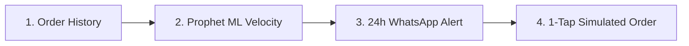
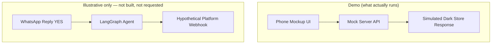
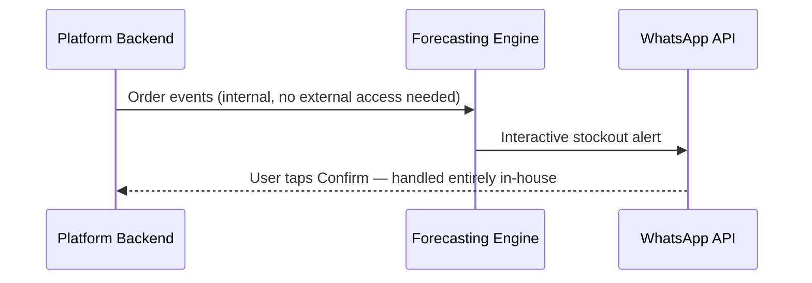

# GROCER — Engineering Prototype & Problem Exploration

---

## A note on what this document is

This is **not a startup pitch, not an SDK for sale, and not a request for API or data access**. It's a write-up of a self-directed prototype I built to explore a real gap I noticed in how quick commerce platforms handle daily-staple replenishment.

I'm not asking anyone to trust me with checkout webhooks or customer data. I'm not asking for a pilot. The goal is simple: show a working ML + agent system I built end-to-end, and open a conversation about the problem itself — with engineers, not procurement.

---

## 1. The problem I noticed

Households run out of daily staples (milk, eggs, bread, atta) on a predictable rhythm, but quick commerce apps are still fundamentally **reactive** — they wait for the user to open the app. Two data points that back this up, cited rather than invented:

- **MilkBasket already built an entire company around subscription-based, scheduled delivery of milk and household staples** — proof the "predictable, recurring staple demand" pattern is real and valuable enough that a standalone company exists to serve it.
- **Blinkit already has a one-tap reorder feature from order history** — proof platforms know repeat-purchase behavior matters, but today it's a passive button, not a predictive nudge.

I don't have internal retention or leakage numbers for any of these platforms, and I'm not going to pretend I do. Any number like "X% of users switch to a local kirana store" would be a guess dressed up as data, and I'd rather flag that honestly than have someone catch it later.

**The actual gap, stated plainly:** platforms have the reactive tools (reorder button, subscriptions). Nobody's shipped the *pre-emptive* version — predicting depletion before the user notices and nudging them somewhere low-friction (WhatsApp) instead of waiting for an app open.

---

## 2. What the prototype does



1. **Ingests order history** (in the demo: seeded synthetic household data) to learn per-item consumption velocity.
2. **Forecasts depletion** using Prophet for variable-consumption items (eggs, oil, atta) and a simple flexi-subscription model for near-fixed items (milk, bread).
3. **Sends a WhatsApp interactive alert** ~24h before predicted stockout — quick-reply buttons for confirm / remind later / skip.
4. **Simulates 1-tap execution** via a 5-node LangGraph agent (`check_pantry → generate_alert → parse_user_reply → build_cart → execute_order`) hitting a **mocked** dark-store endpoint — not a real one.

---

## 3. System architecture

```
Grocer Prototype Architecture:
├── ML Core (Prophet Model + Anomaly Exclusion Gate)
│   ├── Calculates daily consumption velocity (e.g. 0.48L/day)
│   └── Ignores guest-visit spikes (>2.5x baseline) & travel gaps (>5 days)
├── LangGraph Execution Agent (5-Node State Machine)
│   └── check_pantry ──> generate_alert ──> parse_user_reply ──> build_cart ──> execute_order
├── Optional Sub-Modules (not core to the demo)
│   ├── Price Agent: commodity dip monitoring
│   └── Recipe Agent: pantry ingredient cross-checker
└── Demo Interface
    ├── Landing page walking through the problem + prototype
    └── Interactive iPhone mockup running the WhatsApp flow live
```

This stack is genuinely the strongest part of the project — it's a real demonstration of applied ML (time-series forecasting with anomaly handling), agent orchestration (multi-node state machine, not a single prompt), and full-stack shipping ability. That's the actual point of building this.

---

## 4. How the prediction model works

1. **Order ingestion** — timestamp, item_id, quantity per household (synthetic in the demo).
2. **Prophet depletion modeling** (`backend/ml/consumption_model.py`) — per-household daily usage rate → forecasted depletion date.
3. **Anomaly exclusion filter** (`backend/ml/anomaly_detector.py`) — strips bulk/guest purchases and vacation gaps so they don't corrupt the baseline.
4. **Confidence gate** (`backend/ml/confidence_scorer.py`) — alerts only fire above a 0.85 confidence score, to avoid noisy false alerts. This threshold is a design choice for the demo, not a validated production number.

---

## 5. How the dark-store integration is mocked



Everything below the "Demo" line actually runs. Everything in the "Illustrative only" box is there to show what a real integration *could* look like conceptually — it is explicitly **not** something I'm asking any company to grant access to, and I'm not pretending a 2-hour or 48-hour timeline is realistic for anything touching real checkout or payments. Enterprise security review for that kind of access takes months, not hours, and that's appropriate — I wouldn't grant it either.

---

## 6. If this were ever pursued for real, how I'd want to validate it

Not as a pitch — as a description of the honest, low-risk way you'd actually find out if the idea holds up:

1. **Historical backtest on real (anonymized) data.** Run the model against 5 months of past orders, check if it correctly predicts month-6 depletion. This is the only validation step that doesn't require trusting an outside party with anything live — it's just a data science exercise a platform's own team could run just as easily using this approach internally.
2. **Small closed pilot**, only if the backtest actually holds up, run by the platform's own team using their own infrastructure.
3. **Everything else is speculative** until step 1 produces real numbers. I don't have those numbers, and I'm not claiming to.

---

## 7. Conceptual integration shape (not a request for access)

If a platform's engineering team wanted to build something like this internally, the rough shape would be:



The point of showing this isn't "let me build it for you" — it's "here's evidence I understand how this would actually need to be wired, not just the ML part in isolation."

---

## 8. What this explicitly does not attempt

- No B2C standalone app — this only makes sense embedded in an existing platform.
- No manual household logging — barcode scanning, manual pantry entry, etc. are explicitly out of scope.
- No fictitious features — no voice-note NLP, no smart hardware, no hand-wavy claims.
- Recipe and price-dip modules are optional, secondary — not the point of the demo.

Keeping this list is less about marketing discipline now and more about intellectual honesty — it's a record of scope decisions I made and stuck to.

---

## 9. Where this goes from here

I'm not running a sales motion. Realistic next steps, in order of actual likelihood of leading anywhere:

- Publish the repo + demo publicly (GitHub, build-in-public posts) so it's discoverable on its own merits.
- Submit it through structured programs that explicitly invite outside builders (e.g. builder/hackathon challenges run by these platforms), where the legal/IP concerns of unsolicited pitches don't apply.
- Attach it to internship/job applications as a work sample — the goal is a conversation about being hired to work on this class of problem, not a conversation about adopting my specific implementation.
- If it ever reaches an actual engineer or team at one of these companies organically, let the backtest idea (Section 6) be the extent of the "ask" — nothing beyond that.

---

## 10. Engineering decisions & design invariants (reference)

| Decision Area | Decision | Note |
|---|---|---|
| Multi-Item Stockouts | Unified cart bundling | Single alert groups all low items |
| Dark Store OOS Fallback | Smart auto-substitution | Agent suggests nearest matching brand |
| WhatsApp Interaction | Native quick-reply buttons | Confirm / Remind / Skip |
| Demo Scope | Mocked backend throughout | No real platform integration exists or is requested |
