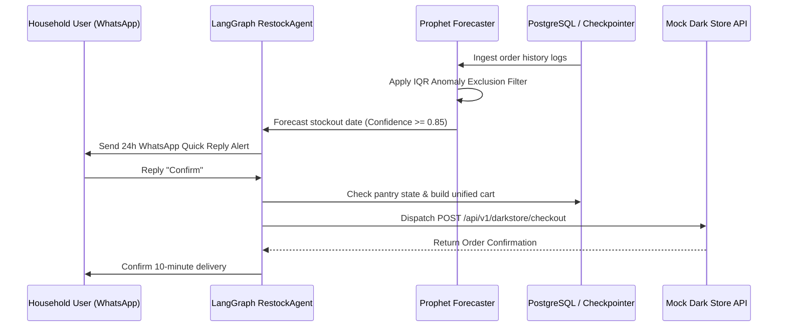

<!-- ╔══════════════════════════════════════════════════════════════════╗
     ║          Grocer — README                                        ║
     ║          Engineering Prototype & Problem Exploration           ║
     ╚══════════════════════════════════════════════════════════════════╝ -->

<div align="center">

  # Grocer

  ### *An engineering prototype & problem exploration for pre-emptive household replenishment in Quick Commerce.*

  <br/>

  
  
  
  
  
  

  <br/>

  <a href="#-about-the-project">About</a> &nbsp;·&nbsp;
  <a href="#-key-features">Key Features</a> &nbsp;·&nbsp;
  <a href="#-tech-stack">Tech Stack</a> &nbsp;·&nbsp;
  <a href="#-prerequisites">Prerequisites</a> &nbsp;·&nbsp;
  <a href="#-getting-started">Getting Started</a> &nbsp;·&nbsp;
  <a href="#-architecture">Architecture</a> &nbsp;·&nbsp;
  <a href="#-environment-variables">Environment Variables</a> &nbsp;·&nbsp;
  <a href="#-available-scripts">Available Scripts</a> &nbsp;·&nbsp;
  <a href="#-testing">Testing</a> &nbsp;·&nbsp;
  <a href="#-deployment">Deployment</a> &nbsp;·&nbsp;
  <a href="#-troubleshooting">Troubleshooting</a>

</div>

---

## 📌 About the Project

**Grocer** is a self-directed **engineering prototype & problem exploration** designed to address a fundamental gap in quick commerce: current platforms (Zepto, Blinkit, Swiggy Instamart, BigBasket) are fundamentally **reactive** (they wait for the user to open the app).

Built with **FastAPI, Next.js 15, Facebook Prophet ML, PostgreSQL, and LangGraph**, Grocer demonstrates an end-to-end predictive replenishment system.

> **Real-World Problem & Benchmarks:**
> - **MilkBasket** built an entire business around scheduled recurring morning deliveries of milk and staples — proving predictable staple demand is a massive, real pattern.
> - **Blinkit** shipped a one-tap reorder button from past order history — proving platforms recognize repeat purchase velocity, though current implementations remain passive.
> - **The Actual Gap:** No platform has shipped a pre-emptive replenishment engine — forecasting stockouts 24h prior and delivering low-friction WhatsApp nudges.

---

## 🚀 Key Features

| Feature | Description | Technical Implementation |
|---|---|---|
| **Time-Series Consumption Modeling** | Calculates daily usage rates per staple (`0.48L/day` for milk) and projects stockout dates. | Facebook Prophet (`backend/ml/consumption_model.py`) |
| **IQR Anomaly Exclusion Gate** | Strips out temporary spikes (guest visits $>2.5\times$ baseline, travel gaps $>5$ days). | Interquartile Range Math (`backend/ml/anomaly_detector.py`) |
| **Confidence Scoring Gate** | Suppresses noisy notifications by gating alerts at a $\ge 0.85$ confidence score threshold. | Confidence Scorer (`backend/ml/confidence_scorer.py`) |
| **5-Node LangGraph Execution Graph** | Deterministic multi-turn restock state machine (`check_pantry → generate_alert → parse_user_reply → build_cart → execute_order`). | LangGraph + PostgreSQL Checkpointer (`backend/agents/restock_agent.py`) |
| **Interactive iPhone 16 Pro Mockup** | 6.3" physical hardware frame with segmented sub-tabs (`Pantry`, `Recipes`, `Signals`) and floating WhatsApp drawer. | React 19 Framer Motion (`frontend/components/PhoneMockup.tsx`) |
| **Mocked Dark Store Webhook Contract** | Standardized REST checkout API simulating dark store dispatch without live payment risks. | FastAPI MCP Server (`backend/mcp/mock_server.py`) |
| **Recipe Pantry Fulfiller** | Parses recipe ingredients, cross-checks current pantry levels, and bundles missing items in 1 tap. | Recipe Agent (`backend/agents/recipe_agent.py`) |
| **Commodity Price Dip Signals** | Tracks market price volatility (tomatoes, oil, atta) in PostgreSQL time-series logs to alert budget households. | Price Intelligence Agent (`backend/agents/price_agent.py`) |

---

## 🛠️ Tech Stack

### Backend Infrastructure
- **Framework:** FastAPI 0.109+ (Python 3.11/3.12)
- **Machine Learning:** Facebook Prophet (Time-series forecasting)
- **Agent Orchestration:** LangGraph (Stateful multi-node state machine)
- **Database & ORM:** PostgreSQL 16 with SQLAlchemy 2.0 (Asynchronous `AsyncSession` driver)
- **String Matching:** RapidFuzz (Levenshtein distance catalog grounding)
- **Testing:** Pytest (16/16 unit & integration tests)

### Frontend Infrastructure
- **Framework:** Next.js 16 (App Router, Turbopack)
- **UI Library:** React 19, Lucide Icons, Sonner Toasts
- **Styling:** Vanilla CSS Design System Tokens (`Outfit` & `Cambo` Google Fonts)
- **Animation:** Framer Motion 12
- **Data Fetching:** SWR (Stale-While-Revalidate caching)

---

## 📋 Prerequisites

Before running Grocer locally, ensure you have the following installed:

- **Python:** `3.11.x` or `3.12.x`
- **Node.js:** `18.x` or `20.x` (pnpm or npm)
- **Git:** Latest version
- **Virtual Environment:** Python `venv` or `uv`

---

## 💻 Getting Started

Follow these step-by-step instructions to get a complete local development environment running in minutes.

### 1. Clone the Repository

```bash
git clone https://github.com/kwakhare5/Grocer.git
cd Grocer
```

### 2. Set Up Python Virtual Environment & Install Dependencies

```bash
# Create virtual environment
python -m venv venv

# Activate on Windows (PowerShell)
.\venv\Scripts\activate

# Activate on macOS/Linux
source venv/bin/activate

# Upgrade pip and install backend dependencies
python -m pip install --upgrade pip
pip install -r requirements.txt
```

### 3. Environment Configuration

Copy the example environment configuration file:

```bash
cp .env.example .env
```

Default local environment values:

```env
DATABASE_URL=sqlite+aiosqlite:///./grocer_dev.db
FASTAPI_ENV=development
NEXT_PUBLIC_API_URL=http://localhost:8000
CONFIDENCE_THRESHOLD=0.85
```

### 4. Run Pytest Backend Test Suite

Verify that all 16 backend unit & integration tests pass:

```bash
python -m pytest backend/tests/ -v
```

Output: `16 passed in 1.41s`.

### 5. Start Backend Server

```bash
uvicorn backend.main:app --reload --port 8000
```

The FastAPI backend will run on **`http://localhost:8000`** (Swagger docs available at `http://localhost:8000/docs`).

### 6. Set Up Frontend Development Server

Open a second terminal window:

```bash
cd frontend

# Install Node.js dependencies
npm install

# Run production build validation
npm run build

# Start Next.js dev server
npm run dev
```

Open **`http://localhost:3000`** in your browser to test the interactive Grocer landing page and iPhone prototype demo live!

---

## 🏗️ Architecture & Data Flow



### Directory Structure

```
Grocer/
├── backend/
│   ├── main.py                     # FastAPI application entrypoint
│   ├── config.py                   # Environment configuration & settings
│   ├── agents/                     # LangGraph agents
│   │   ├── restock_agent.py        # 5-Node restock state machine
│   │   ├── price_agent.py          # Price intelligence watcher
│   │   └── recipe_agent.py         # Recipe pantry fulfiller
│   ├── api/routes/                 # REST API endpoints
│   │   ├── orders.py               # Order ingestion routes
│   │   ├── predictions.py          # Depletion prediction routes
│   │   ├── prices.py               # Price signals feed
│   │   ├── recipes.py              # Recipe parsing routes
│   │   └── restock.py              # Restock trigger routes
│   ├── database/                   # Database models & AsyncSession
│   │   ├── connection.py           # Async engine & sessionmaker
│   │   └── models.py               # Household, Order, ConsumptionModel schemas
│   ├── ml/                         # Time-series ML modules
│   │   ├── consumption_model.py    # Facebook Prophet daily velocity fitting
│   │   ├── anomaly_detector.py     # IQR guest spike & travel gap filter
│   │   └── confidence_scorer.py    # 0.85 confidence gating threshold
│   ├── mcp/                        # Simulated dark store endpoints
│   │   └── mock_server.py          # Mock checkout server
│   └── tests/                      # 16 Pytest test files
│
├── frontend/
│   ├── app/                        # Next.js App Router
│   │   ├── page.tsx                # 6-Section technical showcase stream
│   │   ├── layout.tsx              # Root layout & Google fonts
│   │   └── globals.css             # Vanilla CSS design system tokens
│   ├── components/
│   │   ├── PhoneMockup.tsx         # Interactive iPhone 16 Pro simulator
│   │   ├── grocer/                 # Showcase section components
│   │   │   ├── GrocerHeader.tsx    # Glassmorphism header navbar
│   │   │   ├── GrocerHero.tsx      # Hero section + mockup stage
│   │   │   ├── GrocerValueProp.tsx # 4-Card Architecture Bento Grid
│   │   │   ├── GrocerVelocityCalculator.tsx # Depletion velocity simulator
│   │   │   ├── GrocerAppPreview.tsx# iPhone demo container
│   │   │   ├── GrocerIntegrations.tsx # Webhook architecture diagram
│   │   │   ├── GrocerFAQ.tsx       # Technical FAQ accordion
│   │   │   └── GrocerFooter.tsx    # Showcase footer & CTAs
│   │   └── ui/                     # Reusable design system primitives
│   │       ├── CardSurface.tsx     # Card container surface
│   │       ├── GrocerLogo.tsx      # SVG logo component
│   │       ├── PillBadge.tsx       # Kicker pill badge
│   │       ├── PillButton.tsx      # Tactile pill button
│   │       └── iphone.tsx          # iPhone 16 Pro 6.3" SVG chassis
│   └── lib/                        # Client API hooks & definitions
│
├── PRODUCT_SPEC.md                 # Authoritative engineering specification
├── ARCHITECTURE.md                 # Full technical blueprint
├── CONTEXT.md                      # Domain glossary & business rules
├── JOURNAL.md                      # Product milestone log
└── README.md                       # Master project overview
```

---

## ⚙️ Environment Variables

| Variable | Description | Required | Default |
|---|---|---|---|
| `DATABASE_URL` | SQLAlchemy Async connection URI | Yes | `sqlite+aiosqlite:///./grocer_dev.db` |
| `FASTAPI_ENV` | Application mode (`development`/`production`) | No | `development` |
| `NEXT_PUBLIC_API_URL` | Backend URL for frontend SWR requests | Yes | `http://localhost:8000` |
| `CONFIDENCE_THRESHOLD` | ML gating threshold for alert dispatching | No | `0.85` |

---

## 📜 Available Scripts

| Command | Working Directory | Description |
|---|---|---|
| `python -m pytest backend/tests/ -v` | Root | Run backend Pytest test suite (16 tests) |
| `uvicorn backend.main:app --reload` | Root | Start FastAPI backend server |
| `npm run dev` | `frontend/` | Start Next.js development server |
| `npm run build` | `frontend/` | Run Next.js production build validation |
| `npm run lint` | `frontend/` | Run ESLint and TypeScript typecheck |

---

## 🧪 Testing Guide

```bash
# Run all backend unit & integration tests
python -m pytest backend/tests/ -v

# Run specific test file
python -m pytest backend/tests/test_ml.py -v

# Run frontend build check
cd frontend
npm run build
```

---

## 🛡️ Deployment Targets

- **Frontend:** Next.js deployed on **Vercel** (`npm run build`).
- **Backend:** FastAPI containerized via **Docker** (`docker-compose.yml`) or hosted on **Render**.

---

## ❓ Troubleshooting

### 1. `pytest` command not found
- **Fix:** Ensure your virtual environment is activated, or run `python -m pytest backend/tests/ -v`.

### 2. CORS errors between Next.js and FastAPI
- **Fix:** Verify `NEXT_PUBLIC_API_URL=http://localhost:8000` is present in `frontend/.env.local`.

---

## 👨‍💻 Author & License

Developed by **Karan Wakhare** as a self-directed engineering prototype & problem exploration.
- **GitHub:** [https://github.com/kwakhare5/Grocer](https://github.com/kwakhare5/Grocer)
- **License:** MIT License
