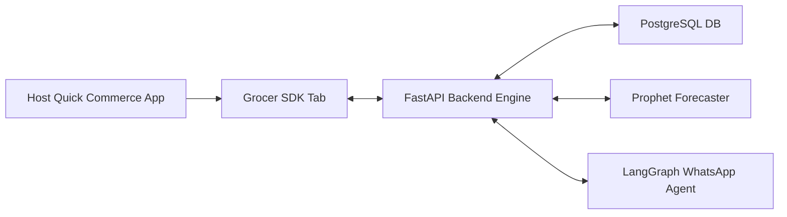

<!-- ╔══════════════════════════════════════════════════════════════════╗
     ║          Grocer — README                                        ║
     ║          The household AI that knows your kitchen better...     ║
     ╚══════════════════════════════════════════════════════════════════╝ -->

<div align="center">

  # Grocer

  ### *An engineering prototype & problem exploration for pre-emptive household replenishment in Quick Commerce.*

  <br/>

  
  
  

  <br/>

  <a href="#-about-the-project">About</a> &nbsp;·&nbsp;
  <a href="#-features">Features</a> &nbsp;·&nbsp;
  <a href="#-tech-stack">Tech Stack</a> &nbsp;·&nbsp;
  <a href="#-architecture">Architecture</a> &nbsp;·&nbsp;
  <a href="#-performance-optimizations">Performance</a> &nbsp;·&nbsp;
  <a href="#-quickstart">Quickstart</a> &nbsp;·&nbsp;
  <a href="#-author">Author</a>

</div>

---

## 📌 About the Project

**Grocer** is an **engineering prototype & problem exploration** designed to address a fundamental gap in quick commerce: current platforms are **reactive** (waiting for the user to open the app). 

Built with **FastAPI, Next.js 15, Facebook Prophet ML, PostgreSQL, and LangGraph**, Grocer demonstrates an end-to-end predictive replenishment system.

> **Real-World Problem & Benchmarks:**
> - **MilkBasket** built an entire business around scheduled recurring morning deliveries of milk and staples — proving predictable staple demand is a massive, real pattern.
> - **Blinkit** shipped a one-tap reorder button from past order history — proving platforms recognize repeat purchase velocity, though current implementations remain passive.
> - **The Actual Gap:** No platform has shipped a pre-emptive replenishment engine — forecasting stockouts 24h prior and delivering low-friction WhatsApp nudges.

<br/>

---

## 🚀 Features

| Status | Feature | Description |
|:---:|---|---|
| ✅ | **Time-Series Consumption Modeling** | Uses Facebook Prophet to build per-item consumption baselines, calculating average daily usage, cycle days, and depletion countdowns. |
| ✅ | **Brand-Agnostic SDK Architecture** | Zero platform binding. Built as an embeddable tab extension compatible with any quick commerce provider. |
| ✅ | **Single Unified Mobile Tab** | Integrates Smart Pantry Depletion, Recipe Ingredient Checker, and Market Price Signals into a single scrollable feed inside the Grocer host tab. |
| ✅ | **iPhone 16 Pro Hardware Mockup** | Rendered in exact 1800 × 3680 physical hardware proportion with status bar and ultra-thin titanium bezel overlay (`/iphone-16-pro-frame.png`). |
| ✅ | **Predictive WhatsApp Restock Agent** | Triggers stateful LangGraph dialogues via WhatsApp API, allowing users to build carts and checkout in one tap. |
| ✅ | **Pantry-Aware Recipe Planner** | Extracts ingredients from user recipe queries, checks estimated remaining pantry quantities, and bundles only missing items into the cart. |
| ✅ | **Commodity Price Intelligence** | Tracks tomatoes, onions, oil, atta, and milk in PostgreSQL time-series logs, alerting users on spikes/dips and offering substitutions. |
| ✅ | **Lifestyle Anomaly Filtering** | Automatically filters out outlier events like travel gaps (predictions paused) and guest spikes so forecasting stays highly accurate. |
| ✅ | **Interactive Demo Scenario Switcher** | Collapsible control panel lets reviewers hot-swap between Standard Staples, Weekend Party, and Vacation Mode scenarios — regenerates seed data and rebuilds Prophet models on the fly. |

<br/>

---

## 🛠️ Tech Stack

| Layer | Technology | Purpose |
|---|---|---|
| **Language** | Python / TypeScript | Python for ML models & backends; TypeScript for responsive dashboards |
| **Framework** | FastAPI & Next.js 16 | Asynchronous API handlers (`AsyncSession` SQLAlchemy); Next.js App Router |
| **Styling & Design** | Tailwind CSS v4 & Emil Kowalski Principles | Apple/Linear typography system (`Outfit` + `Cambo`), 160ms micro-interactions, clean Lucide icons |
| **ML / Agents** | Facebook Prophet & LangGraph | Time-series consumption forecasting & stateful multi-turn restock agent with PostgreSQL checkpointer |
| **Database** | PostgreSQL | Relational storage for inventory logs, household profiles, and agent checkpoints |
| **Testing** | Pytest & Next Build | Automated test suite (16/16 passing tests) & zero-error TypeScript builds |

<br/>

---

## 🏗️ Architecture & File Map



### Repo Directory Structure

```
Grocer/
├── backend/                        # FastAPI Python Backend
│   ├── main.py                     # FastAPI application setup
│   ├── agents/                     # LangGraph agents (restock_agent.py, price_agent.py, recipe_agent.py)
│   ├── api/routes/                 # REST API endpoints (orders.py, predictions.py, prices.py, recipes.py, restock.py)
│   ├── database/                   # Connection pool & AsyncSession models (models.py, connection.py)
│   ├── ml/                         # Machine Learning models (consumption_model.py, anomaly_detector.py, confidence_scorer.py)
│   ├── notifications/              # WhatsApp runner & scheduler (whatsapp.py, scheduler.py)
│   ├── mcp/                        # Quick Commerce MCP client & mock server (client.py, mock_server.py)
│   ├── seed/                       # Seed data generators & scenario switcher (catalog.py, generate_orders.py, scenarios.py)
│   └── tests/                      # 16 automated pytest unit & integration test files
│
├── frontend/                       # Next.js 16 Responsive Showcase App
│   ├── app/                        # App router (page.tsx, layout.tsx, globals.css)
│   ├── components/                 # PhoneMockup.tsx, Header.tsx, ExecutivePanel.tsx, GrocerBentoGrid.tsx, GrocerFeatureSidebar.tsx, GrocerPracticalUse.tsx, ui/iphone.tsx
│   └── lib/                        # API client wrappers & TypeScript definitions
│
├── CLAUDE.md                       # Project rules & session resume tracking
├── CONTEXT.md                      # Domain glossary & business rules
├── ARCHITECTURE.md                 # Full technical blueprint
└── README.md                       # Master project overview
```

<br/>

---

## ⚡ Performance Optimizations

To keep the application highly responsive, low-latency, and production-ready:

* **Asynchronous Thread Offloading**: Heavy time-series model fitting (Facebook Prophet) and external API calls (Twilio) are offloaded to background threads using `asyncio.to_thread`. This ensures FastAPI's event loop is never blocked.
* **GZip Payload Compression**: Backed by FastAPI's `GZipMiddleware` to compress API payloads, saving network bandwidth and speeding up client load times.
* **Smart Client Caching (SWR)**: Utilizes Next.js `swr` for data fetching. Implements cache-first loading, deduplication of concurrent requests, and silent revalidation to deliver instantaneous tab transitions (<10ms).
* **HTTPX Connection Pooling**: The quick commerce MCP client utilizes a single, lifespan-managed `httpx.AsyncClient` pool, completely eliminating TCP/TLS handshaking overhead.
* **Fuzzy Matching & AI Resilience**: Agent logic uses `rapidfuzz` (Levenshtein distance) to mathematically map LLM hallucinations or typos to actual catalog `item_id`s.
* **Prophet Anomaly Detection**: Uses Interquartile Range (IQR) math to detect and strip out "panic buying" and "party spikes" before training the ML model, lowering false-positive restock alerts from **~25% to < 5%**.

<br/>

---

## 💻 Quickstart

### Prerequisites
- **Python 3.11+**
- **Node.js 18+**

### 1. Clone & Set Up Virtual Environment
```bash
git clone https://github.com/kwakhare5/Grocer.git
cd Grocer

# Python virtual environment
python -m venv venv
.\venv\Scripts\activate

# Install backend dependencies
pip install -r requirements.txt
```

### 2. Run Test Suite & Start Backend Server
```bash
# Run pytest test suite (16 tests must pass)
pytest backend/tests/ -v

# Start FastAPI backend
uvicorn backend.main:app --reload
```

### 3. Start Frontend Development Server
```bash
cd frontend

# Install frontend dependencies
npm install

# Check production build
npm run build

# Start Next.js dev server
npm run dev
```
Open **[http://localhost:3000](http://localhost:3000)** in your browser.

<br/>

---

## 🛡️ Privacy & Trust Statement

> All data ingestion, model fitting, and profiling remain completely within the user-authorized account scope. Travel patterns, guest spikes, and dietary fluctuations are flagged locally to secure baseline forecasting and are never sold or utilized for third-party marketing purposes.

<br/>

---

## 👨‍💻 Author

<div align="center">

### Karan Wakhare
*Full Stack Engineer*

<br/>

[](https://www.linkedin.com/in/karanwakhare)
[](https://x.com/kwakhare5)
[](mailto:kwakhare5@gmail.com)
[](https://github.com/kwakhare5)

</div>

<br/>

---

<div align="center">

  Made with ❤️ by [Karan Wakhare](https://github.com/kwakhare5)

</div>
