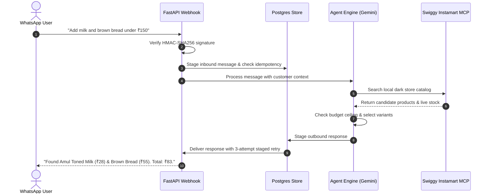

<p align="center">
  
</p>

<h1 align="center">Grocer</h1>

<p align="center">
  <strong>Autonomous WhatsApp grocery replenishment assistant for Swiggy Instamart with real-time dark store cart verification, dynamic UPI payments, and self-healing multi-turn dialog.</strong>
</p>

<p align="center">
  <a href="https://github.com/kwakhare5/Grocer/actions/workflows/quality.yml"></a>
  <a href="https://grocer-backend-qwk4.onrender.com/ready"></a>
  <a href="https://grocerr.vercel.app"></a>
  <a href="https://www.python.org/"></a>
  <a href="https://nextjs.org/"></a>
  <a href="https://ai.google.dev/"></a>
  <a href="https://mcp.swiggy.com/builders/llms.txt"></a>
  <a href="backend/tests/"></a>
</p>

---

## Table of Contents

- [Why Grocer Exists](#why-grocer-exists)
- [The Two Core Pillars](#the-two-core-pillars)
  - [1. Intent Preservation](#1-intent-preservation-multi-turn-cart-memory)
  - [2. Household Replenishment](#2-household-replenishment-cadence-restock-checks)
- [Interactive Demo Flows](#interactive-demo-flows)
- [System Architecture](#system-architecture)
- [Tech Stack](#tech-stack)
- [Prerequisites](#prerequisites)
- [Getting Started (Local Development)](#getting-started-local-development)
- [Interactive Web Simulator](#interactive-web-simulator)
- [Testing & Verification (94 Tests)](#testing--verification-94-tests)
- [Environment Configuration](#environment-configuration)
- [Swiggy Builders Club Reviewer Checklist](#swiggy-builders-club-reviewer-checklist)
- [Code Map](#code-map)
- [Production Deployment](#production-deployment)

---

## Why Grocer Exists

Ordering groceries over conversational interfaces usually breaks down in two common ways:
1. **Fragile Cart Memory**: Most LLM shopping bots treat every message as an isolated prompt. When you say *"actually add 2 more packs of Amul butter and drop the pasta sauce"*, they either wipe your existing cart, lose your budget constraints, or hallucinate product SKUs that don't exist in your local dark store.
2. **Missing Replenishment Intelligence**: Households buy the same staples on predictable cadences (milk every 2 days, eggs every 5 days, bread weekly). Yet users are forced to manually remember, search, and assemble the same repetitive baskets from scratch every week.

**Grocer solves both problems.** It brings **intent-preserving conversational commerce** directly to WhatsApp, powered by Google Gemini 3.5 Flash-Lite, strict server-side state machines, and deep integration with Swiggy Instamart's Model Context Protocol (MCP) gateway.

---

## The Two Core Pillars

### 1. Intent Preservation (Multi-Turn Cart Memory)
Grocer remembers your shopping intent across multiple turns and corrections without losing previously selected items or budget limits:
* **Meal Decomposition**: Say *"pasta for 4 under ₹800"*, and Grocer breaks the meal down into ingredients, matches dark-store pack sizes, and validates total cost against your budget ceiling.
* **Non-Destructive Amendments**: Say *"swap penne for fusilli and make it 2 packs"*, and Grocer updates only that specific line item while preserving the rest of your cart.
* **Deterministic Variant Selection**: When catalog searches return multiple candidates (e.g. 500ml vs 1L milk), Grocer presents numbered interactive choices (`1A`, `1B`). It writes to your cart only after you explicitly select the variant.
* **Hinglish & Natural Quantities**: Understands conversational Indian household requests like *"2 packet doodh, 1 bread aur thoda dhaniya"* without dropping items or misidentifying quantities.

### 2. Household Replenishment (Cadence Restock Checks)
Grocer tracks your historical purchase cadence to predict when household staples are running low:
* **Predictive Cadence Analysis**: Estimates depletion based on your actual order intervals.
* **Conversational Check-ins**: Ask *"what do I need?"* or receive consented restock suggestions based on your opted-in cadence schedule.
* **Consented Actions**: Grocer **never** automatically charges a card or adds items without your explicit agreement. You can correct predictions (*"I still have eggs"*) and Grocer adjusts its model without touching your cart.
* **Full Privacy Control**: Text *"delete my data"* at any time to instantly purge your purchase habits, token vault secrets, and conversation history.

---

## Interactive Demo Flows

### Flow A: Natural Language Recipe with Budget Ceiling
```
User:     "Need ingredients for butter chicken for 4 people under ₹600"
Grocer:   "I've selected ingredients within your ₹600 budget:
           1. Fresh Chicken Breast (500g) — ₹180
           2. Amul Butter (100g) — ₹58
           3. Fresh Cream (250ml) — ₹75
           4. Tomato Puree (200g) — ₹40
           5. Kasuri Methi (50g) — ₹35
           Total: ₹388 (Saved ₹212 under budget)
           Deliver to Home (Indiranagar, Bengaluru)? Reply YES to confirm address."

User:     "Yes, but add 2 packets of garlic naan too"
Grocer:   "Updated! Added 2x Garlic Naan (₹130).
           New Total: ₹518 (Still within ₹600 cap).
           Reply CONFIRM to lock basket and generate payment link."
```

### Flow B: Proactive Household Replenishment Check
```
User:     "What do I need to restock?"
Grocer:   "Based on your household ordering intervals, you're likely low on:
           • Toned Milk (500ml) — last ordered 3 days ago (usual cadence: 2 days)
           • Brown Bread (400g) — last ordered 6 days ago (usual cadence: 5 days)
           Would you like me to add these to your basket?"

User:     "Add the milk, but I still have bread"
Grocer:   "Got it! Adjusted your bread reminder. Added 1x Toned Milk 500ml (₹28) to your cart.
           Total: ₹28. Reply SHOW CART to review or CONFIRM to checkout."
```

---

## System Architecture

```
   ┌─────────────────────────────────────────────────────────────────────────────┐
   │                          WhatsApp Client / Simulator                        │
   └──────────────────────────────────────┬──────────────────────────────────────┘
                                          │ Signed Webhook (HMAC-SHA256)
                                          ▼
   ┌─────────────────────────────────────────────────────────────────────────────┐
   │                       FastAPI Webhook & Security Gateway                    │
   │  • X-Hub-Signature-256 cryptographic verification                            │
   │  • Replay attack prevention & message idempotency                            │
   │  • Rapid burst debouncing (absorbs rapid multi-text bursts)                 │
   └──────────────────────────────────────┬──────────────────────────────────────┘
                                          │
                                          ▼
   ┌─────────────────────────────────────────────────────────────────────────────┐
   │                       Supabase PostgreSQL Message Store                     │
   │  • Durable state staging (inbound_messages, outbound_messages)              │
   │  • Customer token vault (AES-256 encrypted OAuth credentials)               │
   │  • Replenishment cadence history & consented restock schedules             │
   └──────────────────────────────────────┬──────────────────────────────────────┘
                                          │
                                          ▼
   ┌─────────────────────────────────────────────────────────────────────────────┐
   │                    Agent Engine (Gemini 3.5 Flash-Lite)                     │
   │  • Meal & grocery intent decomposition                                      │
   │  • Multi-turn conversational history & pending request memory               │
   │  • Constraint bounds & budget ceiling enforcement                           │
   └──────────────────┬───────────────────────────────────────┬──────────────────┘
                      │                                       │
                      ▼ Catalog & Cart Queries                ▼ Order Checkout Gate
   ┌──────────────────────────────────────┐  ┌───────────────────────────────────┐
   │  Swiggy Instamart Commerce Adapter   │  │   Server-Side Gated Checkout      │
   │  • MCP Gateway (mcp.swiggy.com/im)   │  │  • Explicit user confirmation     │
   │  • Live stock & dark-store inventory │  │  • Price re-verification lock     │
   │  • Multi-candidate catalog ranker    │  │  • Dynamic UPI payment link       │
   └──────────────────────────────────────┘  └───────────────────────────────────┘
```

### Request Lifecycle Sequence


```mermaid
sequenceDiagram
    autonumber
    actor User as WhatsApp User
    participant GW as FastAPI Webhook
    participant DB as Postgres Store
    participant Agent as Agent Engine (Gemini)
    participant Swiggy as Swiggy Instamart MCP

    User->>GW: "Add milk and brown bread under ₹150"
    GW->>GW: Verify HMAC-SHA256 signature
    GW->>DB: Stage inbound message & check idempotency
    GW->>Agent: Process message with customer context
    Agent->>Swiggy: Search local dark store catalog
    Swiggy-->>Agent: Return candidate products & live stock
    Agent->>Agent: Check budget ceiling & select variants
    Agent->>DB: Stage outbound response
    DB->>GW: Deliver response with 3-attempt staged retry
    GW-->>User: "Found Amul Toned Milk (₹28) & Brown Bread (₹55). Total: ₹83."
```

---

## Tech Stack

| Layer | Technologies | Purpose |
|---|---|---|
| **Backend** | Python 3.11+, FastAPI, `asyncpg`, Pydantic v2 | High-throughput asynchronous webhook processing and state management |
| **Database** | PostgreSQL 16 (Supabase / Local) | Durable transaction logs, encrypted OAuth tokens, and staged message queues |
| **Intelligence** | Google Gemini 3.5 Flash-Lite | Multi-turn grocery reasoning, meal planning, and intent parsing |
| **Commerce** | Swiggy Instamart MCP Gateway | Real-time dark store catalog search, basket synchronization, and checkout |
| **Frontend** | Next.js 16 (App Router), React 19, Tailwind CSS v4 | Interactive visual web simulator and public showcase portal |
| **Hosting** | Render (Backend Web Service) & Vercel (Frontend Web App) | Zero-maintenance production serverless and container infrastructure |

---

## Prerequisites

- **Python**: 3.11 or 3.12 (`python --version`)
- **Node.js**: 20+ (`node --version`)
- **npm**: 10+ (`npm --version`)
- **PostgreSQL**: 16 (Supabase cloud connection or local instance for E2E tests)
- **Google AI Studio Key**: API key for Gemini 3.5 Flash-Lite

---

## Getting Started (Local Development)

### 1. Clone the Repository
```powershell
git clone https://github.com/kwakhare5/Grocer.git
cd Grocer
```

### 2. Configure Environment Variables
Copy `.env.example` to `.env`:
```powershell
cp .env.example .env
```
Fill in your required secrets:
```ini
AI_PROVIDER=gemini
GEMINI_API_KEY=your_gemini_api_key_here
GEMINI_MODEL=gemini-3.5-flash-lite
COMMERCE_ADAPTER_TYPE=mock
DATA_ENCRYPTION_KEY=your_32_byte_base64_encryption_key
```

### 3. Install Backend Dependencies
```powershell
pip install -r requirements.txt
```

### 4. Install Frontend Dependencies
```powershell
npm install
```

### 5. Run the Verification Suite
Run the 94-test invariant and integration test suite:
```powershell
pytest backend/tests/test_invariants.py
npm run lint
```

### 6. Start the Servers
Terminal 1 (FastAPI Backend):
```powershell
uvicorn backend.main:app --reload --port 8000
```
Terminal 2 (Next.js Frontend & Simulator):
```powershell
npm run dev
```
Open **[http://localhost:3000](http://localhost:3000)** in your browser to interact with Grocer via the visual simulator.

---

## Interactive Web Simulator

Grocer includes a full-featured web simulator at `http://localhost:3000` (live at [grocerr.vercel.app](https://grocerr.vercel.app)).

* **Signed WhatsApp Intake**: The simulator signs every message with cryptographic HMAC-SHA256 headers, perfectly mirroring Meta's WhatsApp Cloud API.
* **Pre-Loaded Scenarios**:
  * **Recipe & Constraints**: Multi-item ingredient planning under strict rupee budgets.
  * **Interactive Disambiguation**: Selecting specific pack sizes (`1A`, `2B`) when multiple catalog matches exist.
  * **Household Replenishment**: Cadence-based restock checks and non-destructive stock level updates.
  * **Adversarial Edge Cases**: Rapid burst debouncing, forged signatures, and customer data purge requests.

---

## Testing & Verification (94 Tests)

Grocer enforces a **zero-cheat invariant testing philosophy**. Tests never mock internal modules or database tables—they mock only external third-party network APIs (Meta and Swiggy).

```powershell
# Run the 13 fast invariant tests (always run, takes ~0.1s)
pytest backend/tests/test_invariants.py

# Run the complete 94-test battery (with isolated PostgreSQL)
pytest backend/tests/test_invariants.py backend/tests/test_whatsapp_postgres_e2e.py
```

### Test Suite Structure

| Suite | File | Tests | What It Proves |
|---|---|:---:|---|
| **Deterministic Invariants** | `backend/tests/test_invariants.py` | 13 | Budget ceilings, token redaction, signature verification, zero unselected item mutations, address privacy sanitization |
| **Turn Recovery & Resilience** | `backend/tests/suites/turn_recovery.py` | 4 | Crashed turn recovery, zero address demand on greeting, empty cart preservation |
| **Planning & Basket Integrity** | `backend/tests/suites/planning_and_orders.py` | 10 | Unselected SKU protection, ordinal references ("the second one"), Hinglish grocery searches |
| **Cart & Variant Disambiguation** | `backend/tests/suites/cart_and_addresses.py` | 10 | Exact variant choices before writes, rate-limit backoff, retry memory preservation |
| **Recipes & Budget Ceilings** | `backend/tests/suites/recipe_and_budgets.py` | 11 | Multi-item recipe batching, rupee caps, partial-basket warnings, symptom-to-grocery boundaries |
| **Replenishment & Webhooks** | `backend/tests/suites/replenishment_and_webhooks.py` | 13 | Consented cadence restocks, data purge (`delete my data`), forged webhook rejection, gated checkout |
| **Simulator & Channel Safety** | `backend/tests/suites/webhook_and_simulator.py` | 3 | Customer isolation, signed intake validation, local simulator boundary checks |

---

## Environment Configuration

| Variable | Required | Default | Description |
|---|:---:|:---:|---|
| `DATABASE_URL` | Yes (Prod) | - | PostgreSQL connection URL (e.g. Supabase connection pooler) |
| `DATA_ENCRYPTION_KEY` | Yes | - | 32-byte Fernet key for encrypting stored OAuth credentials |
| `AI_PROVIDER` | Yes | `gemini` | Primary AI provider (`gemini`) |
| `GEMINI_API_KEY` | Yes | - | Google AI Studio API key |
| `GEMINI_MODEL` | No | `gemini-3.5-flash-lite` | Gemini model for intent parsing and planning |
| `GEMINI_FALLBACK_MODEL` | No | `gemini-flash-lite-latest` | Fallback model used if the primary model hits transient quotas |
| `COMMERCE_ADAPTER_TYPE` | No | `swiggy` | Adapter implementation (`swiggy` for live MCP, `mock` for offline dev) |
| `WHATSAPP_PHONE_NUMBER_ID` | Yes (Prod) | - | Meta WhatsApp Cloud API Phone Number ID |
| `WHATSAPP_ACCESS_TOKEN` | Yes (Prod) | - | Meta System User Graph API access token |
| `WHATSAPP_APP_SECRET` | Yes (Prod) | - | Meta App Secret for validating incoming HMAC-SHA256 signatures |
| `WHATSAPP_VERIFY_TOKEN` | Yes (Prod) | - | Verification token for Meta webhook subscription handshake |
| `SIMULATOR_ENABLED` | No | `true` | Enables the `/api/simulator/chat` endpoint for the web playground |
| `SIMULATOR_ACCESS_TOKEN` | No | - | Secret bearer token required to send simulator turns |

---

## Swiggy Builders Club Reviewer Checklist

For evaluators reviewing the Swiggy Builders Club submission:

- [x] **Swiggy MCP Boundary**: All Swiggy Instamart interactions are strictly isolated in `backend/integrations/commerce/swiggy_adapter.py` following [mcp.swiggy.com/builders/llms.txt](https://mcp.swiggy.com/builders/llms.txt).
- [x] **Zero Drift**: Never builds dark-store dashboards, fleet logistics, or generic bots; Grocer is dedicated exclusively to intent-preserving consumer grocery replenishment.
- [x] **Autonomous Gated Checkout**: Server-side approval gate requires explicit customer confirmation before any order attempt is executed.
- [x] **Privacy Sanitization**: Delivery addresses strip private flat and building numbers down to safe area labels (e.g. `Home (Koramangala, Bengaluru)`).
- [x] **Production Verification**: 94 tests passing 100% green; live endpoints deployed on Render (`/ready`) and Vercel.

---

## Code Map

```
Grocer/
├── backend/
│   ├── agent/                      # Core agent reasoning & conversation orchestration
│   │   ├── engine.py               # Facade for incoming WhatsApp message handling
│   │   ├── react_coordinator.py    # Multi-turn conversational loop & tool execution
│   │   ├── react_loop.py           # Gemini tool-call scheduler & fallback dispatcher
│   │   ├── basket_manager.py       # Cart state synchronizer & item mutation ledger
│   │   ├── replenishment.py        # Household cadence calculation & restock predictions
│   │   ├── budget.py               # Rupee ceiling validation & overage preventer
│   │   ├── approval.py             # Server-side checkout confirmation gatekeeper
│   │   ├── catalog_ranker.py       # Relevance scoring for dark-store product candidates
│   │   └── guards.py               # Address privacy redaction & medical boundaries
│   ├── api/                        # FastAPI REST & webhook endpoints
│   │   ├── whatsapp.py             # Signed Meta WhatsApp Cloud API webhook receiver
│   │   ├── health.py               # Liveness (/health) and readiness (/ready) checks
│   │   ├── oauth.py                # Swiggy Instamart OAuth token exchange callback
│   │   └── simulator.py            # Signed playground webhook bridge for web UI
│   ├── channels/                   # Channel abstractions & message storage
│   │   ├── whatsapp.py             # Meta Graph API sender with 3-attempt staged delivery
│   │   └── message_store.py        # PostgreSQL message ledger & burst debouncer
│   ├── integrations/commerce/      # Swiggy Instamart integration
│   │   ├── swiggy_adapter.py       # Live MCP client & MockCommerceAdapter
│   │   ├── ports.py                # Abstract CommercePort contract
│   │   └── token_vault.py          # Encrypted customer credential vault
│   └── tests/                      # Verification test battery
│       ├── test_invariants.py      # 13 deterministic system invariant tests
│       ├── test_whatsapp_postgres_e2e.py # 81 integration tests across all flows
│       └── suites/                 # Modular test suites by feature domain
├── app/                            # Next.js 16 App Router frontend
│   ├── layout.tsx                  # Root layout with Geist font tokens & metadata
│   ├── page.tsx                    # Landing page & embedded simulator entry
│   └── globals.css                 # Tailwind CSS v4 design tokens
├── components/                     # Reusable React 19 UI components
│   ├── landing/                    # Showcase sections, feature cards, and FAQs
│   └── simulator/                  # Interactive WhatsApp playground client
├── docs/                           # Architectural specs & Swiggy submission dossier
│   └── SWIGGY_BUILDER_CLUB_APPLICATION.md
├── .github/workflows/              # Continuous integration pipelines
│   ├── quality.yml                 # Runs full 94-test battery & Next.js lint/build
│   └── keep_warm.yml               # Scheduled health pinger for Render web service
├── render.yaml                     # Render Infrastructure-as-Code blueprint
└── package.json                    # Frontend dependencies & scripts
```

---

## Production Deployment

### Backend (Render Web Service)
Grocer is configured for native deployment on Render via `render.yaml`.
- **Health Check Path**: `/ready`
- **Build Command**: `pip install -r requirements.txt`
- **Start Command**: `uvicorn backend.main:app --host 0.0.0.0 --port $PORT`
- **Live Endpoint**: `https://grocer-backend-qwk4.onrender.com/ready`

### Frontend (Vercel)
The Next.js 16 frontend automatically deploys to Vercel on pushes to `main`.
- **Framework**: Next.js App Router (React 19, TypeScript 5)
- **Live Endpoint**: `https://grocerr.vercel.app`

---

<p align="center">
  Built for the <strong>Swiggy Builders Club</strong> · Intent-Preserving Agentic Commerce
</p>
