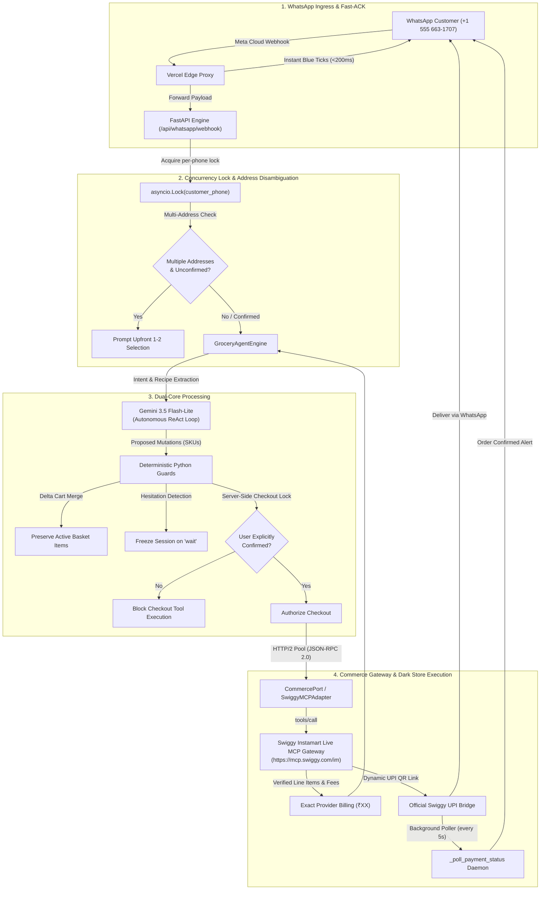

# GROCER Reviewer Walkthrough — Swiggy Builders Club

GROCER is an English-first WhatsApp grocery replenishment agent for Swiggy Instamart. It accepts natural conversational messages, turns them into verified Swiggy Instamart grocery carts, enforces budget caps, and keeps the customer in control of meaningful choices before checkout.

> **Production Status:** The autonomous Gemini ReAct conversation runtime (`GroceryAgentEngine`) is active and verified with Swiggy Instamart dark stores. All 51 invariant and end-to-end backend tests pass 100% green.

---

## Live Test Access

| Channel | Destination / Endpoint |
|---|---|
| **WhatsApp Bot** | `+1 (555) 663-1707` |
| **Consumer Web App** | `https://grocerr.vercel.app` |
| **Backend API Health** | `https://grocer-backend-qwk4.onrender.com/health` |
| **Swiggy OAuth Connect** | `https://grocerr.vercel.app/api/auth/swiggy/login` |

---

## System Architecture



---

## Primary Review Journeys

### 1. Complex Recipe Deduction & Multi-Item Assembly

**Prompt to send on WhatsApp:**
```text
i wanna make pasta i want groceries under 1500
```

**Expected Autonomous Behavior:**
1. **Instant Blue Ticks (<200ms):** Message checkmark immediately turns blue via Meta read receipts.
2. **Delivery Resolution:** Checks stored customer address from Swiggy address book.
3. **Recipe Kit Deduction:** Gemini automatically deduces all 7 core ingredients (pasta, sauce, cheese, butter, onions, garlic, capsicum).
4. **Parallel Catalogue Search:** Fires parallel `search_products` queries via `asyncio.gather`.
5. **Unified Cart Update:** Batches all items into the live Swiggy cart in one turn.
6. **Consolidated Receipt:** Returns a single itemized receipt with line items, delivery fee, taxes, and grand total (e.g. ₹506, well below ₹1,500).
7. **Interactive Controls:** Displays `[Confirm Order]` and `[Change Items]` quick-reply buttons.

---

### 2. Daily Staple Replenishment with Budget Cap

**Prompt to send on WhatsApp:**
```text
Please get 2 litres of milk, one bread, and 12 eggs under ₹500
```

**Expected Autonomous Behavior:**
1. Selects standard in-stock variants for daily staples without unnecessary clarification questions.
2. Respects the ₹500 budget cap.
3. Formats verified currency (`₹XX`) and delivery fees directly from Swiggy's response.
4. Waits for explicit confirmation before any order mutation.

---

### 3. Server-Side Gated Checkout & Dynamic UPI QR

**Prompt to send on WhatsApp:**
Tap the interactive button or type:
```text
Confirm Order
```

**Expected Autonomous Behavior:**
1. **Server-Side Enforcement:** Verifies `is_user_confirmed: True` inside Python code before invoking the Swiggy checkout tool.
2. **Dynamic UPI Generation:** Requests dynamic UPI QR code (`generateUPIQR: True`).
3. **Payment Link Delivery:** Returns the official Swiggy payment bridge link (`https://mcp.swiggy.com/pay/...` or `upi://pay?...`).
4. **Autonomous Polling:** Launches a 60-second background daemon polling payment completion every 5s.

---

### 4. Real-Time Rider Tracking

**Prompt to send on WhatsApp:**
```text
where is my order?
```

**Expected Autonomous Behavior:**
1. Calls `track_order` tool against the active order ID.
2. Reports live driver details, delivery stage, and estimated delivery ETA without hallucination.

---

### 5. Out-of-Stock and Budget Violation Guard

**Prompt to send on WhatsApp:**
```text
get me expensive imported truffles under 50 rs
```

**Expected Autonomous Behavior:**
1. Identifies that the item is unavailable or exceeds the hard budget limit.
2. Refuses to make silent substitutions or hallucinate fictitious items.
3. Explains the issue honestly in plain English and proposes available alternatives.

---

## Local Verification & Quality Gate

To verify the test suite and production build locally:

```bash
# 1. Run all 51 Python backend invariant tests
pytest backend/tests

# 2. Check TypeScript and frontend linting
npm run lint

# 3. Compile Next.js production build
npm run build
```

All 51 invariant tests pass 100% green in ~17s. ESLint passes with 0 errors. Turbopack compiles clean.
