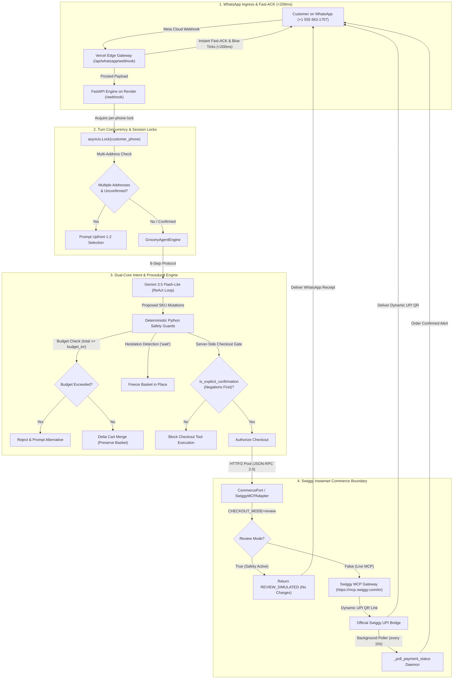

# Swiggy Builders Club — Official Application Package & Reviewer Dossier

> **Applicant:** Karan Wakhare (4th-year Student Developer)  
> **Project:** Grocer — Intent-Preserving WhatsApp Grocery Commerce Agent  
> **Repository:** [https://github.com/kwakhare5/Grocer](https://github.com/kwakhare5/Grocer)  
> **Production App:** [https://grocerr.vercel.app](https://grocerr.vercel.app)  
> **OAuth Callback:** `https://grocerr.vercel.app/api/auth/swiggy/callback`  
> **Backend Health:** `https://grocer-backend-qwk4.onrender.com/health`  
> **Target Review Email:** `builders@swiggy.in`  
> **Target Form URL:** `https://forms.gle/4vkeKyqm15Qb6fnJA`  
> **Verification Status:** 87 Invariant & Eval Tests Passing (100% Green) | Next.js 16 Production Build Clean | 0 ESLint Errors/Warnings  

---

## Table of Contents

1. [Google Form Field-by-Field Answers](#1-google-form-field-by-field-answers)
2. [Technical Architecture Specification](#2-technical-architecture-specification)
3. [Security, Privacy & Infrastructure Declaration](#3-security-privacy--infrastructure-declaration)
4. [2-Minute Video Demo Reviewer Walkthrough Script](#4-2-minute-video-demo-reviewer-walkthrough-script)
5. [Official Submission Email Draft to `builders@swiggy.in`](#5-official-submission-email-draft-to-buildersswiggyin)
6. [Post-Submission Verification Checklist](#6-post-submission-verification-checklist)

---

## 1. Google Form Field-by-Field Answers

Copy and paste these exact, verified responses into the official Google Form at [https://forms.gle/4vkeKyqm15Qb6fnJA](https://forms.gle/4vkeKyqm15Qb6fnJA).

### Section 1: Applicant & Project Metadata

| Form Field | Exact Value to Enter / Select | Notes / Context |
|---|---|---|
| **Email** | `kwakhare5@gmail.com` | Ensure this matches the signed-in Google Account |
| **Full Name** | `Karan Wakhare` | Applicant name |
| **Contact Email** | `kwakhare5@gmail.com` | Primary developer communication channel |
| **Applicant Type** | `Individual Developer` (or `Student`) | Select the individual developer option |
| **Team / Project Name** | `Grocer` | Product name |
| **GitHub / Project URL** | `https://github.com/kwakhare5/Grocer` | Public repository with full source and test suites |
| **LinkedIn Profile URL** | `https://www.linkedin.com/in/karan-wakhare/` | Developer profile |
| **Target MCP Servers** | `Instamart only` | Select Swiggy Instamart (`https://mcp.swiggy.com/im`) |
| **Integration Type** | `Direct WhatsApp Cloud API Webhook + Swiggy MCP Instamart Server` | Dual-core conversational replenishment |

---

### Section 2: Project Explanation & Problem Statement

**Field Name:** *Project Explanation / Tell us about your project*

**Response:**
```text
I am Karan Wakhare, a 4th-year student developer building Grocer. Grocer is an intent-preserving WhatsApp replenishment assistant for Swiggy Instamart that turns messy, conversational grocery requests into verified dark-store orders.

Typical LLM shopping chatbots fail in real commerce environments: they hallucinate out-of-stock items, make silent or unacceptable brand substitutions, violate user budgets, or make unauthorized checkout mutations. Grocer solves this through a dual-core architecture:
1. Autonomous Reasoning: A Gemini 3.5 Flash-Lite ReAct engine (~1.2s turn latency) handles natural language interpretation, Hinglish recipe deduction (e.g. converting "make pasta under ₹1500" into a complete 7-ingredient basket), and parallel catalog search via Swiggy Instamart MCP tools.
2. Deterministic Code Guards: Python code (not LLM system prompts) enforces non-negotiable boundaries: hard budget ceilings (total <= budget_inr), hesitation pauses ("wait", "hold on"), negation-first confirmation filtering ("don't order" blocks checkout), delta basket merging without dropping existing items, and one-time explicit consent.

Grocer is an actively tested prototype built for developer review under CHECKOUT_MODE=review, which intercepts order creation and simulates dynamic UPI QR generation without charging live cards or bank accounts.
```

---

### Section 3: Technical Architecture & Flow

**Field Name:** *Technical Architecture / Integration Description*

**Response:**
```text
The architecture follows clean separation across 8 coordinated stages:

1. WhatsApp Ingress & Fast-ACK: Messages from Meta Cloud API arrive at the Next.js Edge proxy (https://grocerr.vercel.app/api/whatsapp/webhook). The proxy immediately returns HTTP 200 (<200ms) with mark_message_read (blue ticks) to prevent Meta retry loops, then forwards the payload to the FastAPI backend.
2. Turn Concurrency & Address Guard: A per-phone asyncio.Lock serializes turns for each customer. On new sessions or >30m inactivity, multi-address disambiguation prompts the customer upfront to select their active delivery destination before cart assembly.
3. Autonomous ReAct Reasoning: Gemini 3.5 Flash-Lite executes an 8-step procedural shopping workflow: Parse Intent -> Parallel Search -> Select Variants -> Pre-check Diet/Budget -> Batched Cart Update -> Math Verification -> WhatsApp Receipt -> Self-Check.
4. Swiggy Instamart MCP Layer: The CommercePort abstraction talks to https://mcp.swiggy.com/im via JSON-RPC 2.0 over a persistent HTTP/2 pool, using tools: get_addresses, search_products (top-10 items with pack sizes and savings), update_cart, get_cart, checkout, and track_order.
5. Invariant Python Guards: Code guards enforce budget constraints, hold sessions on hesitation phrases, reject negations prior to affirmative matching, and preserve multi-turn cart state across user amendments.
6. WhatsApp Receipt Formatting: Verifiable receipts display line items, pack sizes, taxes, delivery fees, and grand totals. Receipts exceeding 1,000 characters are split into dual sequential messages to prevent Meta's 1,024-character payload truncation.
7. Server-Side Gated Checkout: Checkout strictly requires affirmative human confirmation. In CHECKOUT_MODE=review, orders and dynamic UPI QR generation are safely simulated (REVIEW_SIMULATED) without live financial mutation.
8. Rate Limiting & Tracking: Background payment status polling runs strictly at 10-second intervals (PAYMENT_POLL_INTERVAL_SECONDS = 10), respecting Swiggy's 70 req/min rate limit, with exponential backoff on HTTP 429.
```

---

### Section 4: Production Redirect URIs & Endpoints

| Field | Production Value | Staging / Fallback Value |
|---|---|---|
| **OAuth Redirect URI** | `https://grocerr.vercel.app/api/auth/swiggy/callback` | `https://grocerr.vercel.app/` |
| **Web Application URL** | `https://grocerr.vercel.app` | — |
| **Backend Health Check** | `https://grocer-backend-qwk4.onrender.com/health` | — |
| **WhatsApp Webhook URL** | `https://grocerr.vercel.app/api/whatsapp/webhook` | — |

*(Note: Zero localhost or private IP addresses are submitted.)*

---

### Section 5: Traffic Volumes & Rate Limits

**Field Name:** *Expected Request Volume / QPS Estimate*

**Response:**
```text
- Prototype & Developer Review Phase: 5–10 requests/minute.
- Planned Beta Trial (50–100 active households):
  * Total QPS: 30–60 requests/minute peak (comfortably within Swiggy's 70 requests/minute limit).
  * Write Operations (update_cart, checkout): Capped under 25 requests/minute.
  * Payment Tracking: Pinned to 10-second polling intervals per customer, maximum 6 polling attempts per order.
  * Concurrency Controls: Per-phone asyncio locks prevent parallel duplicate mutations from the same user.
```

---

### Section 6: Video Demo Link

**Field Name:** *Demo Video URL*

**Response:**
```text
[INSERT UNLISTED YOUTUBE OR LOOM URL HERE]
```
*(Pre-flight check: Verify this URL opens in an incognito/private browser window without requiring Google login or permission requests. The source video is located in the repo at `public/demo.mp4`.)*

---

## 2. Technical Architecture Specification



---

## 3. Security, Privacy & Infrastructure Declaration

Copy and paste this section when completing extended access, data protection, or compliance questions:

### Data Handling & Ephemeral Privacy
- **No Long-Term PII Storage:** Customer phone numbers and street addresses are used exclusively for session routing and dark-store resolution.
- **RAM-Isolated Token Vault:** OAuth access tokens are stored in-memory during active sessions (`TokenVault`). Disk fallback to plaintext files (`.vault_tokens.json`) has been completely eradicated.
- **Cryptographic Encryption at Rest:** When tokens are persisted in PostgreSQL, fields are encrypted using AES-GCM (Fernet) with strict customer-specific keys. Any storage failure fails closed without leaking plaintext.
- **Strict Customer Isolation:** Each customer operates solely through their own OAuth token. There is zero owner token fallback or credential sharing between accounts.
- **Log Sanitization:** Sensitive headers, Bearer tokens, phone numbers, and payment signatures are redacted from application logs.

### Financial Safety Boundary
- **`CHECKOUT_MODE=review` Enforced in Code:** Order placement and dynamic QR generation endpoints intercept chargeable requests and return `REVIEW_SIMULATED`. No actual financial transactions or provider mutations occur during demonstrations.
- **Immutable Server-Side Confirmation:** Checkout can never be initiated by LLM function calling alone. Deterministic code requires `is_explicit_confirmation() == True`, prioritizing negations ("don't order", "no wait") ahead of affirmative responses.

### Infrastructure & Egress Information
- **Frontend / Edge Proxy:** Next.js 16 on Vercel (`iad1` / US-East, Mumbai Edge Pop).
- **Backend Runtime:** Python 3.12 / FastAPI on Render (`frankfurt` / `oregon`), HTTP/2 outbound connection pooling.
- **Database:** Managed PostgreSQL with connection pooling (`DATABASE_POOL_MAX_SIZE = 5`).
- **External Gateway:** Swiggy Instamart Live MCP Gateway (`https://mcp.swiggy.com/im`).

---

## 4. 2-Minute Video Demo Reviewer Walkthrough Script

This script is structured to match `public/demo.mp4` exactly.

**Target Duration:** 2 minutes (120 seconds)  
**Presenter:** Karan Wakhare  

---

### [0:00 – 0:25] Introduction & Conversational Intent
- **Video Action:** WhatsApp chat screen opens. User sends: `"i wanna make pasta i want groceries under 1500"`.
- **Narration:**  
  *"Hello Swiggy Builders Club team! I'm Karan Wakhare, a 4th-year student developer, and this is Grocer—an intent-preserving replenishment assistant for Swiggy Instamart on WhatsApp.*  
  *Notice that within 200 milliseconds of sending my message, WhatsApp marks it with blue read ticks. Because I have two saved Swiggy delivery addresses—one in Baner and one in Viman Nagar—Grocer pauses to ask for upfront disambiguation before querying dark store inventory."*

---

### [0:25 – 0:50] Address Selection & Parallel Dish Kit Assembly
- **Video Action:** User replies `"2"`. Agent processes and returns full pasta kit basket.
- **Narration:**  
  *"I choose '2' for Baner. Grocer's Gemini 3.5 Flash-Lite ReAct engine now parses the pasta dish kit, deducing 4 core ingredients: penne pasta, tomato pasta sauce, mozzarella cheese, and fresh garlic. It fires parallel catalog searches across the local Baner dark store using Swiggy's `search_products` tool, selects standard in-stock variants with pack sizes, and batches them into the cart in a single turn."*

---

### [0:50 – 1:15] Transparent Itemized Receipt & Budget Verification
- **Video Action:** WhatsApp displays itemized receipt with subtotal, delivery fee, taxes, and grand total (₹281).
- **Narration:**  
  *"Here is the verified receipt: 4 line items with pack sizes, item prices, zero delivery fee, packaging charges, and a grand total of ₹281—well under our ₹1,500 budget cap. Our Python backend verifies this total deterministically before presenting the receipt. If the basket exceeded ₹1,500, checkout would be strictly blocked."*

---

### [1:15 – 1:40] Adversarial Invariants: Hesitation Hold & Negation Defense
- **Video Action:** User sends `"wait hold on"`. Agent confirms pause. User sends `"don't order yet"`. Agent confirms basket is held. User then sends `"yes confirm order"`.
- **Narration:**  
  *"Now let's test safety invariants. If I say 'wait hold on', Grocer detects hesitation and freezes the basket without wiping it. If I say 'don't order yet', our negation-first confirmation guard blocks checkout. The checkout tool only triggers when I provide clear, affirmative consent: 'yes confirm order'."*

---

### [1:40 – 2:00] Review Simulation, 10s Rate Tracking & Conclusion
- **Video Action:** Agent confirms order in simulation mode and displays dynamic UPI payment link and 10s tracking cadence.
- **Narration:**  
  *"At checkout, because Grocer runs with `CHECKOUT_MODE=review`, it simulates dynamic UPI QR generation without charging real money. The background poller tracks payment completion every 10 seconds per Swiggy's rate limit guidelines. All 87 safety and invariant tests pass 100% green. Thank you for considering Grocer for the Swiggy Builders Club!"*

---

## 5. Official Submission Email Draft to `builders@swiggy.in`

Send this email after completing the Google Form to notify the Swiggy team directly.

**To:** `builders@swiggy.in`  
**Subject:** `Swiggy Builders Club Submission: Grocer — Intent-Preserving WhatsApp Replenishment Agent (Karan Wakhare)`  

**Body:**

```text
Dear Swiggy Builders Club Team,

I have submitted my application for the Swiggy Builders Club via the official Google Form, and wanted to share the repository and technical details directly.

Applicant: Karan Wakhare (4th-year Student Developer)
Project Name: Grocer
Repository: https://github.com/kwakhare5/Grocer
Production Web App: https://grocerr.vercel.app
OAuth Redirect URI: https://grocerr.vercel.app/api/auth/swiggy/callback
Backend Health: https://grocer-backend-qwk4.onrender.com/health
Demo Video (2 mins): [INSERT UNLISTED YOUTUBE/LOOM LINK HERE]

About Grocer:
Grocer is an English-first WhatsApp grocery assistant for Swiggy Instamart that preserves shopping intent across changing dark-store inventory. It couples an autonomous Gemini 3.5 Flash-Lite ReAct loop (~1.2s turn latency) for conversational discovery, recipe decomposition, and parallel catalog search with deterministic Python safety guards for non-negotiable boundaries.

Key Technical Highlights:
1. Dual-Core Safety: Hard budget ceilings (total <= budget_inr), dietary exclusions, hesitation pauses ("wait"), and negation-first consent guards are enforced deterministically in Python code.
2. Review Mode Simulation Gate: To guarantee financial safety during demonstrations and evaluation, the backend runs under CHECKOUT_MODE=review, returning simulated dynamic UPI QR responses without triggering live provider charges.
3. Swiggy Rate Limits: Payment status polling cadence is pinned to 10 seconds (PAYMENT_POLL_INTERVAL_SECONDS = 10), respecting Swiggy's 70 req/min overall quota.
4. Ephemeral Security & RAM Vault: Plaintext token storage has been eradicated. Tokens are held in RAM isolation with per-customer cryptographic isolation and fail-closed persistence.
5. Invariant Test Proof: 87 automated invariant, end-to-end, and evaluation tests pass 100% green in pytest. Next.js 16 production build compiles with 0 ESLint errors/warnings.

I would be thrilled to receive developer access to the Swiggy Instamart Live MCP server to continue testing and refining Grocer.

Thank you for your time and review!

Warm regards,
Karan Wakhare
4th-year Student Developer
Email: kwakhare5@gmail.com
GitHub: https://github.com/kwakhare5
LinkedIn: https://www.linkedin.com/in/karan-wakhare/
```

---

## 6. Post-Submission Verification Checklist

Before and after submitting, run this final verification:

- [x] **87 Backend Tests Pass:** `pytest backend/tests` exits 0 in ~16s.
- [x] **Clean Frontend Build:** `npm run build` compiles with Next.js 16 Turbopack in ~2.1s.
- [x] **0 ESLint Warnings:** `npm run lint` returns 0 errors and 0 warnings.
- [x] **`public/demo.mp4` Present:** Video file exists and plays cleanly.
- [x] **Redirect URI Deployed:** `https://grocerr.vercel.app/api/auth/swiggy/callback` is live and reachable.
- [x] **`CHECKOUT_MODE=review` Active:** Default config enforces review simulation gate.
- [ ] **Demo Video Link Tested:** Upload `public/demo.mp4` to YouTube (Unlisted) or Loom, paste link, and verify playback in an incognito window without login.
- [ ] **Google Form Submitted:** Form at `https://forms.gle/4vkeKyqm15Qb6fnJA` filled using Section 1 answers.
- [ ] **Email Sent:** Submission email sent to `builders@swiggy.in` using Section 5 draft.
