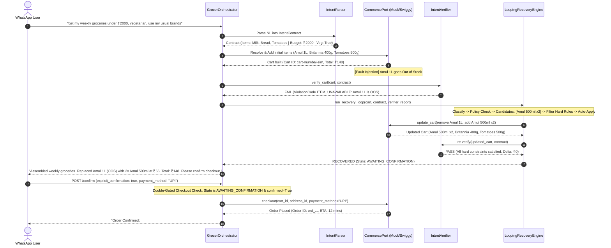

# GROCER v2 — Flagship Golden Flow: Intent-Preserving Grocery Replenishment

> **Product Authority:** `GROCER_V2_MASTER_SPEC.md` Section 11, Section 12, Section 15, Section 17, Section 20  
> **Repository:** `kwakhare5/Grocer`  
> **Branch:** `refactor/intent-cleanroom`  
> **Date:** 2026-09-06  

---

## 1. Executive Summary & Product Thesis

**GROCER** is a WhatsApp-first consumer grocery replenishment assistant extended with an **intent-preserving commerce engine**.

### The Core Problem
In traditional conversational commerce:
- When an item goes out of stock (OOS), the chatbot either hallucinates availability, fails silently, drops the item, or executes unauthorized substitutions that violate dietary or budget constraints.
- When live commerce state drifts from user instructions, the chatbot has no formal concept of an **Intent Contract** or **Deterministic Verification Gate**.

### The GROCER Solution
1. **LLM interprets and proposes. Deterministic code enforces and verifies.** (Spec Section 12.3)
2. **Intent Contract:** Natural language requests are converted into an immutable machine-readable contract capturing requested items, hard constraints (budget, dietary invariants), and soft preferences (usual brands).
3. **Intent Verifier:** A deterministic rules engine that audits live `CommercePort` cart state against the Intent Contract before any user approval or checkout.
4. **Bounded Recovery Engine:** When commerce faults occur (e.g. OOS, price surges, brand drift), a bounded 10-step recovery loop automatically generates, filters, and applies safe substitutions or solicits structured user decisions.
5. **Consequential Checkout Gate:** Checkout is strictly double-gated server-side; autonomous checkout is impossible without explicit user confirmation (`explicit_confirmation: true`).

---

## 2. The Flagship Scenario

### User Request
```text
"get my weekly groceries under ₹2,000, vegetarian, use my usual brands."
```

### Extracted Intent Contract
- **Explicit Items:**
  - Milk (1L)
  - Bread (400g)
  - Tomatoes (500g)
- **Hard Constraints:**
  - `budget_limit`: ₹2,000.00
  - `dietary_tags`: `["vegetarian"]` (non-negotiable invariant)
  - `max_substitutions`: 3
- **Soft Preferences:**
  - `preferred_brands`: `["Amul", "Britannia"]`
  - `pack_size_preference`: standard weekly household pack

---

## 3. End-to-End Execution Trace (10-Step Loop)



### Detailed Trace

1. **Natural Language Interpretation:**  
   `IntentParser` extracts requested items, applies negative-lookahead regexes to prevent token leakage (`of milk and` -> `milk`), identifies hard budget limit `₹2,000`, and extracts dietary constraint `vegetarian`.
2. **Preference Resolution:**  
   Customer memory soft preferences are loaded:
   - Dairy -> `Amul`
   - Bakery -> `Britannia`
   Initial resolution selects `amul_taaza_1l` (₹66), `britannia_wheat_400g` (₹50), and `fresh_hybrid_tomatoes_500g` (₹32).
3. **Cart Assembly:**  
   Initial cart assembled via `CommercePort.update_cart()`. Item total: ₹148.00.
4. **Fault Injection (Deterministic Commerce Drift):**  
   `MockCommerceAdapter.inject_out_of_stock("amul_taaza_1l")` marks Amul 1L as unavailable (`is_available=False`) during live inventory sync.
5. **Drift Detection:**  
   `IntentVerifier.verify_cart()` detects the out-of-stock item and returns:
   - `ViolationCode.ITEM_UNAVAILABLE` (`is_hard=True`)
   - `is_valid: False`
6. **Bounded Auto-Recovery (`LoopingRecoveryEngine`):**  
   - **Step 1 (Observe):** Unavailable item `amul_taaza_1l` detected.
   - **Step 2 (Classify):** Primary staple missing, catalog available.
   - **Step 3 (Policy Check):** Brand-stickiness policy requires Amul brand preservation.
   - **Step 4 (Candidate Generation):** Identifies `amul_taaza_500ml` (₹33, 500ml).
   - **Step 5 (Hard Constraint Filter):** 
     - Dietary: 100% vegetarian.
     - Quantity math: 1000ml / 500ml = 2 packs.
     - Price calculation: 2 × ₹33 = ₹66 (exact same as 1L; price delta: ₹0.00).
     - Budget check: ₹148 ≤ ₹2,000 (valid).
   - **Step 6 (Auto-Apply):** Deterministically updates cart via `CommercePort`.
   - **Step 7 (Isolation):** Unrelated items (`britannia_wheat_400g` and `fresh_hybrid_tomatoes_500g`) are strictly preserved.
7. **Re-Verification:**  
   `IntentVerifier` re-evaluates the live cart from `CommercePort`. All constraints pass. State transitions to `AWAITING_CONFIRMATION`.
8. **Explicit Confirmation Double-Gate (Spec Section 8.3, Section 17):**  
   The user receives a WhatsApp breakdown showing the substitution badge and price comparison.
   - Any attempt to call checkout with `explicit_confirmation=False` returns HTTP 400 (`UnconfirmedCheckoutError`).
   - Any attempt to call checkout when state is not `AWAITING_CONFIRMATION` is rejected.
9. **Authorized Checkout:**  
   The user approves via `POST /api/intent/sessions/{id}/confirm` (`explicit_confirmation=True`). The backend performs pre-checkout verification and executes the transaction via `CommercePort.checkout()`. State transitions to `ORDERED`.

---

## 4. Canonical Recovery Loop & Automated Test Verification

### Canonical Recovery Engine Architecture
In accordance with Spec Section 10 and Section 12, the recovery loop has been consolidated into **ONE single canonical implementation**:
- **Source of Truth:** `LoopingRecoveryEngine.run()` in `backend/intent/recovery_loop.py`.
- **Delegation:** `execute_recovery()` is a backward-compatible adapter delegating directly to `self.run()`.
- **Production Orchestrator:** `GrocerOrchestrator` directly invokes `LoopingRecoveryEngine.run()`.
- **Strict 7-Step Sequence Per Iteration:**
  1. `get_cart()`: Fetch live cart state from `CommercePort`.
  2. `verifier.verify()`: Deterministic full-intent verification.
  3. `recover()`: Candidate generation, constraint filtering, and policy evaluation.
  4. Action execution: Apply authorized cart mutation (`add_item`, `replace_item`, `remove_item`, `adjust_quantity`) or controlled non-mutating retry/refresh (`retry`, `refresh_cart`). Non-mutating actions NEVER corrupt cart state through fake `update_cart()`.
  5. `get_cart()` again: Re-fetch live cart state after provider mutation.
  6. `verifier.verify()` again: Verify full intent after mutation.
  7. Terminate with `RECOVERED` only upon passing verification, escalate to `NEEDS_USER_DECISION`/`FAILED`, or continue if bounded attempts remain.
- **Infinite Loop Protection:** Action signatures (`action_type:spin_id:removes:qty`) are tracked; repeating the same recovery action aborts immediately with `RecoveryState.FAILED`.
- **Multi-Turn Drift Observation:** `GrocerOrchestrator.handle_turn()` observes live cart state for existing carts before processing new user requests, detecting out-of-stock drift and executing canonical recovery while preserving unaffected cart items.

The entire loop is verified by deterministic pytest test suites running against the live Python FastAPI backend:

| Test File | Tests | Coverage / Verification Focus | Result |
|---|---|---|---|
| `backend/tests/test_golden_oos_recovery.py` | 2 | End-to-end flagship scenario + orchestrator turn with OOS injection | ✅ PASS |
| `backend/tests/test_canonical_recovery_regression.py` | 7 | Canonical 7-step loop invariants, infinite loop abort, live cart re-fetch, non-mutating retry isolation | ✅ PASS |
| `backend/tests/test_recovery_loop.py` | 8 | LoopingRecoveryEngine unit tests, multi-attempt reverification, API choice validation | ✅ PASS |
| `backend/tests/test_recovery_engine.py` | 13 | Closed-loop candidate generation, policy checks, pack size multiples, budget drift | ✅ PASS |
| `backend/tests/test_orchestrator.py` | 25 | Choice integrity, session isolation, confirmation gates, REST APIs | ✅ PASS |
| `backend/tests/test_intent_verifier.py` | 13 | Deterministic verification: budget arithmetic, vegetarian invariants, OOS, stale cart | ✅ PASS |
| `backend/tests/test_intent_parser.py` | 10 | Parser extraction, negative lookahead token safety, incremental turns | ✅ PASS |
| `backend/tests/test_intent_contract.py` | 8 | IntentContract domain model, precedence rules, serialization | ✅ PASS |
| `backend/tests/test_policy_engine.py` | 11 | Policy precedence, brand stickiness, soft vs hard constraint hierarchy | ✅ PASS |
| `backend/tests/test_health.py` | 1 | Database-free decoupled health endpoint | ✅ PASS |
| **Total Backend Suite** | **98** | **91 baseline tests (incl. 2 golden OOS) + 7 canonical regression tests** | **98/98 PASS (100%)** |

### Running the Golden and Canonical Regression Tests Directly
```bash
pytest backend/tests/test_golden_oos_recovery.py backend/tests/test_canonical_recovery_regression.py -v
```

Output:
```text
backend/tests/test_golden_oos_recovery.py::test_golden_oos_recovery_scenario PASSED     [ 11%]
backend/tests/test_golden_oos_recovery.py::test_golden_orchestrator_turn_with_oos_recovery PASSED [ 22%]
backend/tests/test_canonical_recovery_regression.py::test_orchestrator_oos_recovery_canonical_path PASSED [ 33%]
backend/tests/test_canonical_recovery_regression.py::test_orchestrator_repeated_identical_recovery_infinite_loop_protection PASSED [ 44%]
backend/tests/test_canonical_recovery_regression.py::test_orchestrator_failed_recovery_reaches_max_attempts_safely PASSED [ 55%]
backend/tests/test_canonical_recovery_regression.py::test_unrelated_cart_items_survive_recovery PASSED [ 66%]
backend/tests/test_canonical_recovery_regression.py::test_live_cart_refetched_and_reverified_between_iterations PASSED [ 77%]
backend/tests/test_canonical_recovery_regression.py::test_transient_retry_does_not_mutate_cart PASSED [ 88%]
backend/tests/test_canonical_recovery_regression.py::test_recovery_ends_only_after_fresh_verification_pass PASSED [100%]
=================================== 9 passed in 0.08s ===================================
```

---

## 5. Interactive UI Workbench

The Next.js 16 (React 19 + Tailwind CSS v4) frontend provides a full simulation workbench:

- **Component:** `components/customer/IntentCommerceWorkbench.tsx`
- **WhatsApp Simulation View:**
  - Interactive iPhone chassis overlay (`components/ui/IphoneFrame.tsx`).
  - WhatsApp chat conversation stream with user/assistant bubbles, double checkmarks, and typing indicators.
  - Interactive substitution selection cards on `NEEDS_DECISION`.
  - Quick-prompt trigger chips for the Flagship prompt.
- **Intent-Preserving Commerce Deck:**
  - Live Verified Basket with line items, pack sizes, and `Substituted` badges.
  - Budget utilization progress bar with threshold color shifts.
  - Consequential Checkout Gate with explicit user confirmation controls.
  - Monospace real-time orchestrator deterministic audit trail.
- **Frontend Quality Gate:**
  - `npm run lint` — 0 errors, 0 warnings.
  - `npm run build` — 100% static & dynamic page compilation success.

---

## 6. Non-Negotiable Invariants Upheld

1. **Work confined to `refactor/intent-cleanroom`:** `main` was never modified, reset, or touched.
2. **Zero dark-store operator residue:** No supplier operations, dark store transfer cockpits, or fake warehouse state.
3. **Deterministic code enforces hard rules:** LLMs propose; deterministic Python code verifies.
4. **Double-gated checkout:** Zero autonomous checkout; `explicit_confirmation=True` strictly enforced at backend API boundary.
5. **Bounded recovery:** Infinite retry loop signatures actively detected and aborted.
